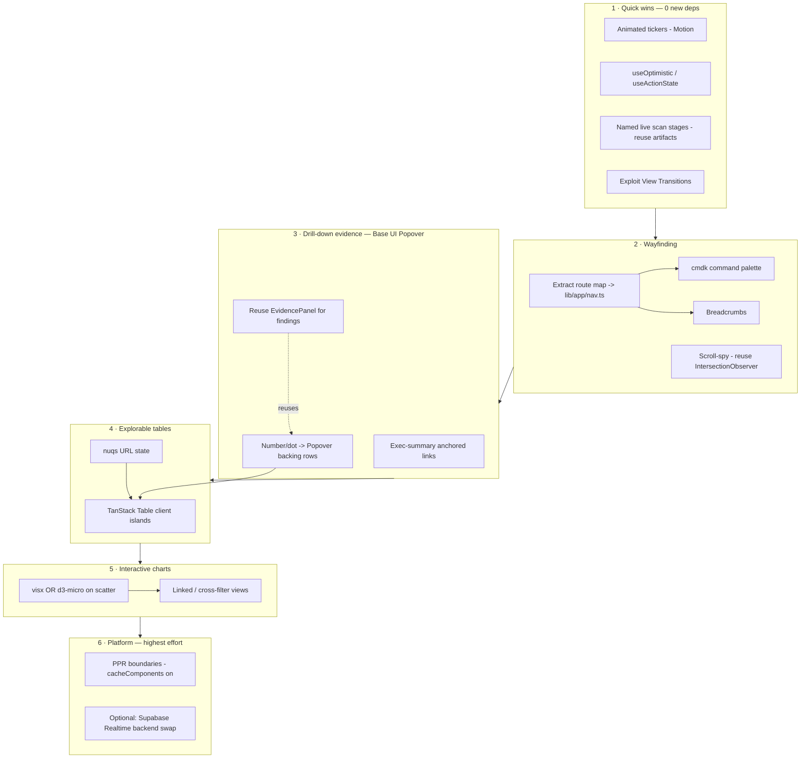

# ReachKit UX Stack Upgrade — Strategic Roadmap (refined)

## Context

ReachKit pays real API calls (DataForSEO, Tavily, Anthropic) to compute a deep, well-typed
market-intelligence payload. The data model is excellent; the bottleneck is the **front-of-house
treatment** — reports are largely *static*, read-only surfaces with no fast way to move through a
data-dense product. This roadmap identifies the modern UX capabilities we are *not* yet using that
would (a) make reports explorable/drill-downable, (b) give Linear/Vercel-class wayfinding, and
(c) make the product feel premium and fast.

**Decisions already locked with the user:** roadmap only (no code this round); open to best-in-class
deps judged on RSC/bundle fit; prioritise the three workstreams below; AI conversational layer parked.

**This refinement** re-grounds the draft against the actual code. Four draft claims were inaccurate
and the recommendations are corrected accordingly (see "Corrections from exploration"). Nothing here
is committed; each workstream is independently greenlightable.

---

## Corrections from exploration (read first — these change recommendations)

1. **Scan is already SSE, not polling.** `app/(funnel)/scan/[id]/scan-stream.tsx` uses `EventSource`
   against `app/api/scan/[id]/stream/route.ts`, resuming from a cursor with heartbeats. The *server
   route* polls `scan_events` every 250ms internally; the **client already gets live streaming**.
   → "Replace polling with Supabase Realtime" is mis-framed. Realtime would only remove the route's
   internal DB poll (a backend cost/latency optimisation), not change what the user sees. **Demoted**
   to an optional backend item; the real W3 scan win is making `ScanProgress` reflect *named pipeline
   stages*, which the event stream already carries as `artifact` labels.

2. **All report tables are server components.** Competitor / keyword-gap / demand / top-pages render
   server-side in `components/report/market-analysis-sections.tsx` inside `DeepSection`. Adding
   sort/filter (TanStack Table) and URL state (nuqs) requires **new `"use client"` islands** — not the
   "incremental, no architectural change" the draft implies. Plan reflects the island boundary.

3. **`cacheComponents: true` is already set** in `next.config.ts` (PPR/Cache Components enabled, and
   the SSE route is explicitly written to coexist with it). PPR work is **adding `"use cache"`/Suspense
   boundaries**, not enabling the platform feature.

4. **`EvidencePanel` is finding-scoped.** It consumes `FindingEvidence | ActionCardEvidence`
   (`components/report/evidence-panel.tsx`); evidence arrays exist on Findings/ActionCards (the four
   sections WhatYouOffer / WhoItsFor / WhereTheyAre / ActionPlan), **not** on computed market numbers
   (benchmark medians, SOV %, keyword volume). Demand pockets, top pages, recent buzz and keyword rows
   **already link their backing data**. → The drill-down layer is "reveal the rows/evidence that
   *already exist*," surfaced in a Popover — not a new evidence model spanning every number.

**Reusable assets found:** working `IntersectionObserver` pattern in
`components/sections/how-it-works-scroll.tsx` (scroll-spy base); `EvidencePanel` (drill-down content);
sidebar route map inline in `components/app/app-sidebar.tsx` (`primaryItems`/`utilityItems`).
**Not present yet:** any Popover/HoverCard wrapper in `components/ui` (only dialog/tooltip/tabs), and
cmdk (the `shadcn` CLI is a dep, so wrappers can be generated).

---

## Where the stack already meets the bar (don't rebuild)

| Area | Status |
|---|---|
| Design tokens / theming / dark mode | OKLCH "Almanac" system — single source of truth, keep |
| Motion infra | GSAP + Motion + Lenis + View Transitions wired (`next.config.ts` `viewTransition: true`) — under-used, not missing |
| Bundle discipline | Custom SVG charts (`components/charts/*`, `ui/sparkline.tsx`) — preserve, extend |
| Component primitives | shadcn + Base UI headless primitives installed |
| Live scan | SSE stream with cursor-resume + heartbeat already shipped — extend, don't replace |
| PPR | `cacheComponents` already on — add boundaries |

The gaps are **interaction, wayfinding, and perceived performance**, not foundations.

---

## Workstream 1 — Interactive drill-down viz

**Standard:** sort, filter, hover-for-detail, drill from a number into its evidence.
**Current:** `market-analysis-sections.tsx` tables are presentational server components; the scatter
(`ease-impact-scatter.tsx`) has hover but no click-to-expand; exec-summary numbers don't link to evidence.

**Toolkits (RSC/Tailwind-friendly, lean):**
- **TanStack Table v8** (headless, logic-only) for the data-dense tables: competitor profiles, keyword
  gap, demand pockets, top pages. Keep our Tailwind/token styling. Pattern: extract the row data in the
  server section, render a small `"use client"` `<DataTable>` island for the interactive body (the
  static server render stays the no-JS fallback). Add **TanStack Virtual** only if a table exceeds ~100
  rows (current slices are ≤6–~20 — virtualisation not needed yet).
- **Base UI `Popover`/`HoverCard`** (Base UI installed; needs a `components/ui` wrapper, generate via
  shadcn) as the **drill-down layer**: click a number/dot → Popover showing the rows/evidence that
  already back it. Reuse `EvidencePanel` for finding-backed sections; for market numbers surface the
  existing backing rows (threads, pages, ranking keywords). No new evidence data model.
- **visx** *or* **d3-scale + d3-shape micro-deps** for genuinely interactive charts. Keep hand-rolled
  SVG for donut/bars/sparkline; adopt real scales/axes/voronoi only for the scatter
  (`ease-impact-scatter.tsx`, already `"use client"`) and any future trend/cross-filter chart. Decide
  visx vs micro-libs at greenlight (visx = more batteries; micro-libs = absolute minimum).
- **nuqs** (type-safe URL search-params) so sorts/filters/active-drill-down live in the URL —
  shareable, deep-linkable, back-button-safe; pairs with View Transitions. Requires the client island.

**Concrete applications:** sortable competitor/keyword/demand/top-pages tables (sort by score / volume /
recency / thread count; filter by channel/surface); click-to-expand on scatter dots and exec-summary
proof cells; exec-summary figures become anchored links into their detail section (`#summary`,
`#competitors`, `#benchmark`, … already wired via `section-nav.tsx` + `scroll-mt`); cross-filtering
(selecting a competitor highlights it across channel matrix, SOV, scatter — linked views).

**Effort:** medium. TanStack Table + nuqs adopt per-table; each conversion is one new client island.

---

## Workstream 2 — Navigation & wayfinding

**Standard:** ⌘K command palette, scroll-spy section nav, breadcrumbs, keyboard shortcuts.
**Current:** good static sidebar + section-nav row; no keyboard movement, no search.

**Toolkits:**
- **cmdk** (Vercel/Linear standard; shadcn wraps it as `Command`). ⌘K palette to jump to any app
  route / report section / play, run a scan, trigger export, toggle theme, open billing. Client island,
  tiny. **First extract the route map** from `app-sidebar.tsx` (`primaryItems`/`utilityItems`) into a
  shared `lib/app/nav.ts` so the palette, sidebar, and breadcrumbs share one source of truth.
- **Scroll-spy active state** on `section-nav.tsx` — reuse the existing `IntersectionObserver` pattern
  in `components/sections/how-it-works-scroll.tsx` (no new dep) so the sticky nav highlights the section
  in view; `buildSectionNavItems` already yields the anchor list to observe.
- **Breadcrumbs** for `/app/*` and `/report/[slug]` (shadcn breadcrumb), reusing the extracted route map.
- **Keyboard layer** (`?` shortcut sheet, `g d` dashboard, `g f` feed) — small, high perceived quality.

**Concrete applications:** `components/app/app-sidebar.tsx` (route-map source),
`components/report/section-nav.tsx`, the three surfaces (`scan/[id]/results`, `(app)`, `report/[slug]`).
Global search over report data is a later add (needs an index) — palette first.

**Effort:** low–medium. cmdk + scroll-spy self-contained.

---

## Workstream 3 — Perceived performance & polish

**Standard:** instant shells, realtime progress, optimistic actions, tasteful micro-interactions.
**Current:** SSE scan stream (good), Suspense skeletons (static), little animation despite GSAP+Motion.

**Capabilities (mostly already in-stack — under-used):**
- **Named live scan stages** — `ScanProgress` already receives `artifacts` (the `artifact` event
  labels) via `scan-stream.tsx`. Surface them as an explicit, ordered stage list
  (queued → collecting → extracting → synthesizing → critiquing → formatting; cf. `ACTIVE_STATUSES`)
  with live check-off, instead of a generic animation. **No new dep, no backend change.**
- **`useOptimistic` + `useActionState`** (React 19, available) for instant Server-Action feedback —
  mark a play done, save onboarding, dismiss an alert — no spinner round-trips.
- **Animated number tickers** via **Motion** (`animate`/`useSpring`, installed) — score count-up on
  report load (`executive-summary.tsx` headline, `score-block-dashboard.tsx`), delta roll on trend
  changes. Respect `prefers-reduced-motion` (existing convention; guard in `app/globals.css`).
- **Milestone moments** — restrained celebration in `components/app/engagement-strip.tsx` on a material
  week-over-week score jump (Motion-driven; `canvas-confetti` ~1.5kb only if we want the classic burst).
- **PPR boundaries** — `cacheComponents` is already on; upgrade static Suspense skeletons to true
  partial prerender by adding `"use cache"` + Suspense boundaries around data-dependent regions
  (`(app)` report surfaces). Lean on the `vercel:next-cache-components` skill. No runtime dep.
- **Exploit View Transitions** (enabled) for cross-route + section morphs — currently barely used.
- **(Optional, backend) Supabase Realtime** to replace the stream route's 250ms `scan_events` DB poll
  (`@supabase/supabase-js` already shipped). Cost/latency optimisation only — *not* user-visible, since
  the client is already SSE. Lowest priority; do only if DB poll load becomes a concern.

**Effort:** low for stages/tickers/optimistic/View Transitions; medium for PPR boundaries.

---

## Cross-cutting

- **Accessibility:** roving tabindex on the scatter (`ease-impact-scatter.tsx` already gives each dot
  `tabIndex`/`role=button`/`aria-label` — extend to arrow-key roving + click-expand); focus management
  in the new palette/popovers (Base UI covers most). Budget a dedicated sweep.
- **URL as state** (nuqs) underpins W1 drill-down and shareable views — adopt once, reused across tables.
- **Container queries** (Tailwind v4 native) for component-responsive cards/tables vs viewport
  breakpoints — improves the mobile/thumb-friendliness flagged in the Explore pass.

---

## Recommended adoption sequence

1. **Quick wins (low effort, high feel):** tickers + `useOptimistic` + named scan stages + View
   Transitions. Zero/low new deps; proves momentum.
2. **Wayfinding:** extract route map → cmdk palette + scroll-spy. Self-contained, instantly noticeable.
3. **Drill-down evidence:** Base UI Popover linking numbers/dots → backing rows (reuse `EvidencePanel`);
   exec-summary anchored links.
4. **Explorable tables:** TanStack Table islands on competitor/keyword/demand/top-pages + nuqs URL state.
5. **Interactive charts:** visx (or d3-micro-libs) for scatter expand + cross-filter linked views.
6. **Platform:** PPR boundaries; optional Supabase Realtime backend swap. Highest infra effort — last.

---

## Deliberately deferred

- **AI conversational "ask your report" layer** (Vercel AI SDK generative UI/streaming over our
  structured data). Biggest comprehension unlock; de-prioritised this round. Note: adopting it means
  switching the direct `@anthropic-ai/sdk` usage to the AI SDK for streaming + generative UI.
- **Branded PDF / OG share images** (Satori / react-pdf). `report/[slug]/opengraph-image.tsx` already
  exists and CSV export exists; revisit when shareability becomes a priority.
- **Heavy opinionated dashboard kits** (Tremor, MUI, Nivo) — off-philosophy (pull Recharts/theming
  weight). Headless TanStack + composable visx chosen instead.

---

## Verification (per workstream, at greenlight)

- **W1:** competitor/keyword/demand/top-pages tables sort + filter; numbers/dots with backing data open
  a Popover revealing it; a shared filtered view round-trips through the URL. Smoke-test with
  `REACHKIT_USE_FIXTURES=true` across free + paid reports; confirm the no-JS server render still shows
  the table (island is progressive).
- **W2:** ⌘K reaches every app route, report section, and primary action by keyboard; section nav
  highlights on scroll; breadcrumbs reflect `/app/*` and `/report/[slug]`. Keyboard-only pass.
- **W3:** scan page shows named pipeline stages checking off live (already SSE — verify no regression in
  cursor-resume/heartbeat); report shell paints before data (PPR boundaries); play/onboarding/alert
  actions feel instant (no spinner round-trip); reduced-motion users get final state immediately.
- **All:** `pnpm typecheck && pnpm test && pnpm lint` green; `pnpm check:bundle` reviewed per new dep
  (TanStack Table, nuqs, cmdk, visx/d3, optional canvas-confetti); `pnpm test:render` smoke passes;
  Lighthouse/CWV not regressed (Vercel performance skill available).

---

## Open decisions for next round

- visx **vs** d3-micro-libs for interactive charts (both lean; visx = batteries, micro-libs = minimum).
- Whether the optional **Supabase Realtime** backend swap is worth doing at all (client is already SSE;
  only justified if `scan_events` poll load matters).
- Whether to pull the **AI conversational layer** forward into a Workstream 4.
