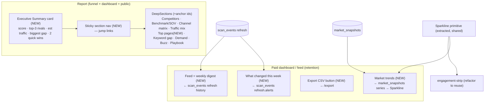

# ReachKit — UX Optimization Ultraplan (surface every signal)

## Context

Phases 1–4 made the **data stream** rich and correct: market analysis (competitor profiles, traffic-mix estimate, channel matrix, share-of-voice, keyword gap, top pages, demand pockets, recent buzz, marketplace presence), the Ease×Impact×Competition playbook, per-metric narratives, weekly market alerts, and weekly `market_snapshots` history. But a UX audit (3 explore passes) shows a large **data→surface gap**: several things we *pay API calls to compute* are **never shown to anyone**, and the report has become a flat ~12-section scroll with no hierarchy.

**Governing principle (from the user):** *every extracted data point must be surfaced and useful — never waste an API call or hold data back except as a deliberate monetization lever. Applies to both free (teaser) and paid (full), on both the funnel report and the paid dashboard.*

This plan does two things: (1) **close every orphaned-data gap** so nothing computed is discarded, and (2) **restructure the report** with an executive summary + anchored section nav for scannability (the user's chosen IA).

### Data → Surface audit (the spine — every artifact must have a home)

| Data (where computed) | Surfaced today? | Fix |
|---|---|---|
| Score + radar/subscores | ✅ ScoreBlock | keep; feed exec summary |
| 4-question sections, competitive landscape, channels, creators, strengths | ✅ rendered | keep |
| Competitor profiles: SEO kw/etv/authority/refdomains, channels+cadence, communities | ✅ CompetitorProfilesSection + benchmark | keep |
| Traffic-mix estimate, channel matrix, SOV, keyword gap, demand pockets, recent buzz, marketplace, playbook triad | ✅ MarketAnalysisSections | regroup + anchor |
| **`SeoPosture.topPages`** (Phase 2) | ❌ **computed, rendered NOWHERE** | **B1: render** (paid "Top pages") |
| **Weekly `MarketAlert[]`** (refresh) | ❌ **emitted in scan_event, read by nothing** | **B2: render** "What changed this week" + feed |
| **`market_snapshots`** weekly history | ❌ **stored, no UI** | **B3: trends UI** (sparklines) |
| **`scan_events` refresh digest** | ❌ only during active scan; feed is a stub | **B4: real feed/digest** |
| **CSV export** (`/api/app/[id]/export`) | ❌ **route exists, no button** | **B5: export button** |
| Score history (`score_snapshots`) | ✅ engagement-strip sparkline | extract shared primitive |

> Free scans run the **light pass** (no backlinks/ranked-keywords/marketplace/buzz), so there's nothing wasted there — but everything the light pass *does* compute (competitors, channels, traffic estimate, SOV, demand pockets) must be teased. `redactMarket` already teases these; the IA work makes them prominent.

---

## Workstream A — Report IA: executive summary + anchored scroll

**A1. `components/report/executive-summary.tsx` (NEW, content-as-props).** A top-of-report scorecard — the ChannelIntel "page 1". Props derived by a pure helper `buildExecutiveSummary(report)` (NEW in `lib/scan/report.ts` or a sibling): headline score + one-line verdict; top-3 competitors with overlap/est-traffic; your est. organic traffic vs rival median; the single biggest gap (top `market.plan.items[0]` or top `keywordGap`); 1–2 quick wins (`whatToDoThisWeek.quickWins`). Reuse tokens + DeepSection styling. Free shows the numbers (strong teaser); paid identical (it's a summary, not gated).

**A2. `components/report/section-nav.tsx` (NEW).** A sticky, horizontally-scrollable row of jump links to section anchors (`#competitors`, `#benchmark`, `#channels`, `#keyword-gap`, `#demand`, `#playbook`, …). Dependency-free; matches mono-eyebrow styling. Hidden when only a few sections exist (free light report).

**A3. `components/report/deep-section-shell.tsx`.** Add an optional `id` prop to `DeepSection` so every section is an anchor target for A2. Thread `id`s through `market-analysis-sections.tsx` sub-sections.

**A4. Wire into the three surfaces:** `app/(funnel)/scan/[id]/results/page.tsx`, `app/(app)/app/page.tsx`, and `app/report/[slug]/page.tsx` — render `<ExecutiveSummary>` directly under the score, then `<SectionNav>`. Reuse the existing `redactReportForTier` output (no gating change needed).

## Workstream B — Close the orphaned-data gaps

**B1. Top pages (paid).** Add `TopPagesSection` to `market-analysis-sections.tsx` rendering `market.cohort.self.seo.topPages` (url · keyword count · etv), gated `unlocked`. Add `narrateTopPages` to `lib/scan/gap/narrate.ts`. Strip `topPages` for free in `entitlements.ts redactProfile` (already strips `seo` detail — extend to drop `topPages`/`rankedKeywords`).

**B2. "What changed this week" (paid retention).** New reader `lib/scan/digest.ts → latestRefreshDigest(appId)`: load the app's latest scan, read the most recent `scan_events` row of type `refresh`, return `{ weekOf, changes, alerts }` (the `alerts` array the refresh already emits — no new table needed). New `components/app/whats-changed.tsx` renders the `MarketAlert[]` (competitor launches / SOV shifts / keyword opps) with kind-specific icons + the `changes` digest. Mount near the top of `app/(app)/app/page.tsx`.

**B3. Market trends (paid).** New reader `lib/scan/market-trends.ts → marketTrendSeries(appId)` (server, service-role like `engagementSummary`) over `market_snapshots.summary` → time series for SOV %, self organic-keywords vs rival median, keyword-gap count, demand-pocket count. New `components/app/market-trends.tsx` renders each as a labelled **Sparkline** (D1) with a current-value + delta. Mount on the dashboard and/or a `#trends` section. (RLS: reads are server-side service-role, so **no new RLS policy required**; add the owner-read policy only if we later client-fetch.)

**B4. Feed = real weekly digest (paid).** Replace the `app/(app)/app/feed/page.tsx` "coming soon" stub with a timeline reading `scan_events` of type `refresh` across the app's scans (reuse `latestRefreshDigest` shape, plus a list query), rendering each week's `changes` + `alerts`. Remove the `comingSoon` flag on the Feed nav item in `components/app/app-sidebar.tsx`.

**B5. CSV export button (paid).** New `components/app/export-button.tsx` — a paid-gated download linking to `GET /api/app/[id]/export` (route already built + gated). Place on the dashboard header and the paid report. Free sees it as a locked affordance pointing at `#unlock`.

## Workstream C — Free→paid conversion (monetize what's teased)

**C1. Elevate the strongest teasers above the paywall.** In `results/page.tsx` (free branch), render the Executive Summary + a compact teaser of the highest-impact visuals (traffic-mix bar, SOV bar, channel-matrix summary) **above** `UpgradeCta`, so the "wow" lands before the wall. These already exist as components; reorder/duplicate the teaser, keep full detail gated.

**C2. Sharpen `components/report/upgrade-cta.tsx`.** Update the unlock bullets to name the now-built deliverables: full you-vs-rival benchmark + SOV, channel matrix, **keyword gap**, **top pages**, **marketplace presence**, the **Ease×Impact×Competition playbook**, **weekly alerts + trends**, and **CSV export**. Drive each gated section's `LockNote` label via the existing `computeLockCounts` pattern (extend it for the new sections).

## Workstream D — Shared visualization primitive

**D1. Extract `components/ui/sparkline.tsx`** from the inline SVG in `components/app/engagement-strip.tsx` (lines 27–110) into a reusable, prop-driven primitive (data points, width/height, up/down color). Refactor `engagement-strip.tsx` to consume it (no behavior change), and reuse it in B3. Keeps the codebase dependency-free (no chart lib — matches the design system).

---

## Files (grouped)

- **New components:** `components/report/executive-summary.tsx`, `components/report/section-nav.tsx`, `components/ui/sparkline.tsx`, `components/app/whats-changed.tsx`, `components/app/market-trends.tsx`, `components/app/export-button.tsx`.
- **New readers/pure:** `lib/scan/digest.ts` (`latestRefreshDigest`, `listRefreshDigests`), `lib/scan/market-trends.ts` (`marketTrendSeries`), `buildExecutiveSummary` (in `lib/scan/report.ts`), `narrateTopPages` (in `lib/scan/gap/narrate.ts`).
- **Edited:** `components/report/deep-section-shell.tsx` (+`id`), `components/report/market-analysis-sections.tsx` (TopPages section + anchor ids + grouping), `components/report/upgrade-cta.tsx` (bullets), `lib/billing/entitlements.ts` (`redactProfile` drops `topPages`/`rankedKeywords`; extend `computeLockCounts` consumers), `app/(funnel)/scan/[id]/results/page.tsx`, `app/(app)/app/page.tsx`, `app/report/[slug]/page.tsx`, `app/(app)/app/feed/page.tsx`, `components/app/app-sidebar.tsx`, `components/app/engagement-strip.tsx`.
- **Reuse (do not rebuild):** `DeepSection`/`LockNote` (deep-section-shell), `EvidencePanel`, `redactReportForTier`, `engagementSummary`/`ScoreHistoryPoint`, `assembleWeeklyPlan`, design tokens in `app/globals.css`, the existing per-metric narrators in `lib/scan/gap/narrate.ts`.

## Sequencing

1. **D1** (sparkline) → unblocks B3.
2. **A1–A4** (exec summary + nav + anchors) — biggest scannability win, touches all surfaces.
3. **B1, B5** (top pages, export button) — smallest gaps, pure wins.
4. **B2** (alerts/"what changed") then **B3** (trends) then **B4** (feed) — the retention/operating-system layer.
5. **C1, C2** (conversion polish) — last, once the sections they reference exist.

## Verification

- **Unit (vitest):** `buildExecutiveSummary`, `marketTrendSeries` shaping, `latestRefreshDigest`/`listRefreshDigests` (mock `scan_events`/`market_snapshots` like `lib/scan/profile/cache.test.ts`), `narrateTopPages`, and the extended `redactProfile` (asserts `topPages` stripped on free). Render-smoke the new components.
- **Gating parity:** extend `lib/billing/entitlements.test.ts` so `topPages` is full on paid / absent on free.
- **Fixtures E2E:** `REACHKIT_USE_FIXTURES=true` — run a scan (free + paid), confirm the results page shows the exec summary + nav and every computed section has a home; run `runWeeklyRefresh` twice (seed a delta) and confirm `whats-changed` + `feed` render alerts and `market-trends` shows ≥2 points.
- **Manual:** click the CSV export button (paid → file; free → `#unlock`); verify sticky nav jump links scroll to anchors; verify the public report shows the exec summary (viral) without leaking paid detail.
- `pnpm typecheck && pnpm test && pnpm lint` green; changed files lint-clean.

## Out of scope
New chart library (stay inline-SVG), daily/real-time alerts (weekly only), X/Twitter wiring, Notion/Sheets export, prompt caching / Sonnet competitor-analysis (still deferred from Phase 4).
