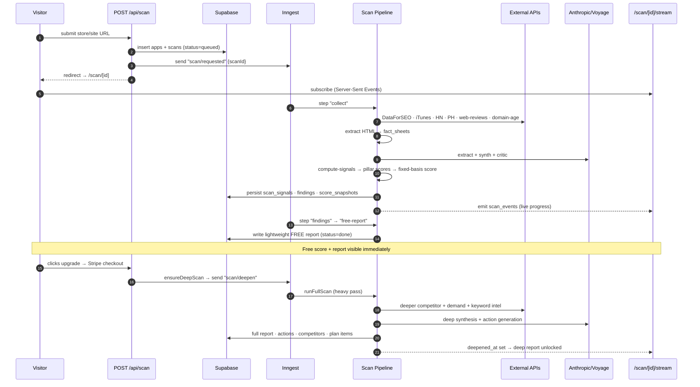
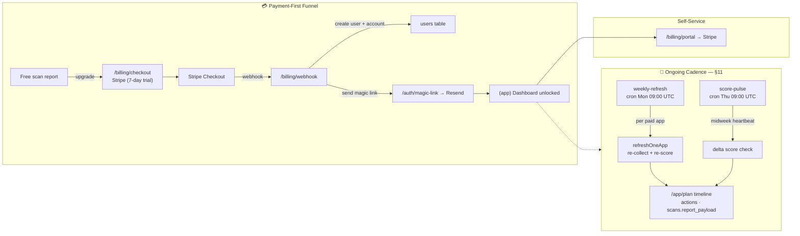

# ReachKit — Architecture, Data Flow & Processes

> Living architecture document. Update this as the system evolves.
> Last updated: 2026-07-08

ReachKit is a single-stack Next.js 16 (App Router) application deployed on Vercel.
There is no separate backend service — API routes are thin, and all heavy /
long-running work is offloaded to **Inngest** background functions hosted at
`/api/inngest`. State lives in **Supabase** (Postgres + RLS + pgvector).

---

## 1. System Architecture & Data Flow

```mermaid
graph TB
    subgraph client["👤 Client (Browser)"]
        Visitor["Anonymous Visitor"]
        User["Authenticated User"]
    end

    subgraph vercel["▲ Vercel — Next.js 16 App Router"]
        subgraph routes["Route Groups"]
            MKT["(marketing)<br/>landing · /scan · /gallery<br/>/pricing · /teardowns/[slug]<br/>/tools/* · /compare/[slug]"]
            FUN["(funnel)<br/>/scan/[id] report<br/>Stripe→Email→Magic-Link wall"]
            APP["(app) — gated dashboard<br/>/app · /plan · /dashboard<br/>/demand · /supply · /synthesis<br/>/competitors · /billing"]
        end

        subgraph api["API Routes (app/api)"]
            AScan["/scan · /scan/[id]/stream<br/>/scan/[id]/checkout"]
            AApp["/app/intel · /app/[id]/refresh<br/>/app/[id]/queue · /voice"]
            ABill["/billing/checkout · /webhook<br/>/portal · /trial"]
            AAuth["/auth/magic-link"]
            AComp["/competitors/candidates · /select"]
            AAct["/action · /content-draft · /distribute"]
            AIng["/api/inngest (function host)"]
        end
    end

    subgraph core["⚙️ Core Libs (lib/)"]
        Pipeline["lib/scan — pipeline<br/>collect→extract→synth→critic→format"]
        Score["Scoring Engine<br/>SIGNAL_REGISTRY (~18 signals)<br/>3 pillars: SEO · Content · Outreach"]
        Adapters["lib/scan/adapters<br/>data collectors"]
        LLMlib["lib/llm — Anthropic<br/>extract · synth · critic · actions"]
        Deepen["lib/scan/deepen<br/>free → full/deep gate"]
    end

    subgraph jobs["🔄 Inngest (Background Jobs)"]
        JReq["scan/requested"]
        JDeep["scan/deepen"]
        JDemo["scan/demo.requested"]
        JVerify["action/verify"]
        JWeekly["weekly-refresh<br/>cron Mon 09:00"]
        JPulse["score-pulse<br/>cron Thu 09:00"]
        JClean["search-cache-cleanup"]
    end

    subgraph data["🗄️ Supabase (Postgres + RLS + pgvector)"]
        DBcore["apps · scans (report_payload)<br/>findings · actions · scan_signals<br/>score_snapshots · fact_sheets · scan_events"]
        DBintel["competitors (selection)<br/>demand_intel (read-through cache)<br/>search_cache (cachedJson blobs)"]
        DBinfra["users · billing · pipeline_runs<br/>embeddings (pgvector)<br/>public_scans (view)"]
    end

    subgraph ext["🌐 External Services"]
        Anthropic["Anthropic Claude<br/>(LLM synthesis)"]
        Voyage["VoyageAI<br/>(embeddings)"]
        DFS["DataForSEO<br/>backlinks · keywords · rank · traffic"]
        Tavily["Tavily (web search)"]
        Sources["Public sources<br/>iTunes/App Store · HN Algolia<br/>Product Hunt · YouTube · X<br/>G2 · Trustpilot · web.archive"]
        Stripe["Stripe (billing)"]
        Resend["Resend (email/magic-link)"]
        PostHog["PostHog (analytics)"]
    end

    Visitor -->|"submit URL"| AScan
    User --> APP
    APP --> AApp

    AScan -->|"insert app+scan<br/>send scan/requested"| JReq
    AScan -.->|"stream progress (SSE)"| FUN
    AApp --> Pipeline
    AComp --> Adapters

    JReq --> Pipeline
    JDeep --> Deepen --> Pipeline
    JDemo --> Pipeline
    JWeekly --> Pipeline
    JPulse --> Score

    Pipeline --> Adapters
    Pipeline --> Score
    Pipeline --> LLMlib
    Pipeline -->|"persist"| DBcore
    Deepen -->|"emit scan/deepen"| JDeep

    Adapters --> DFS
    Adapters --> Tavily
    Adapters --> Sources
    LLMlib --> Anthropic
    LLMlib --> Voyage
    Voyage --> DBinfra

    ABill <-->|"checkout · webhook · portal"| Stripe
    Stripe -.->|"webhook → create account"| AAuth
    AAuth --> Resend
    ABill --> DBinfra

    Pipeline --> DBintel
    api --> DBcore
    routes -.->|"read"| PostHog
    AIng -.hosts.-> jobs
```

---

## 2. Scan Flow — from URL to Report (two-tier: free → deep)

---

## 3. Accounts, Billing & Recurring Cadence (§11)

---

## 4. Data lineage — SOURCE → STORAGE → INTERPRETATION → UI

The map that answers "where does this number come from / why is this screen
blank?" without re-scanning. Read the per-scan **`/app/diagnostics`** page for the
live populated/empty state of any given scan.

### 4.1 Per-data-type lineage

| Data | Source | Storage | Interpretation | UI surface |
|------|--------|---------|----------------|------------|
| On-site score | HTML fetch + SERP (DataForSEO) | `scans.score_total` / `score_breakdown` | `compute-signals` → fixed-basis `headlineScore` (8 keys) | Dashboard gauge ("On-site readiness") |
| Pillar bars | 18 `scan_signals` | `scan_signals` | `registryScore` → `pillarRollupFromRegistry` (assessed = signal measured) | Dashboard hero pillars |
| Market position | off-site signals (backlinks, keywords, presence) | `scans.report_payload.marketPosition` | `marketPositionScore` (cohort-relative) | Dashboard hero ("Market position vs rivals") |
| Competitors / referrers | DataForSEO backlinks + traffic | `search_cache` (`funnel2:*` cachedJson) + `report_payload` | `gatherFullFunnel` → `buildBreakdown` | Audience → Competitors |
| Keyword gap | DataForSEO ranked_keywords | `search_cache` (`synth:*`) + `report_payload.market.gap` | `gatherKeywordGap` | Audience → Keywords |
| Demand / pockets | Reddit/community search + keyword ideas | `search_cache` (`demand-intel:*`) **and** `demand_intel` table | `gatherDemand` | Audience → Customers |
| Buyer insights | competitor review mining (Tavily) + own reviews/community (2C fallback) | inside the demand payload | `mineCompetitorReviews` | Audience → Customers |
| Creators | YouTube adapter | `report_payload.creatorsToReach` | `find-creators` (brand-relevance gated) | Audience → Creators |
| Plan / actions | LLM synthesis | `actions` table + `report_payload.whatToDoThisWeek` | `synthesizeKeyActions` / action generation | Plan · Dashboard "this week" |

### 4.2 The `report_payload` contract (paid report = `scans.report_payload`)

The paid report is **not** a set of joined tables — it is the single
`scans.report_payload` JSON blob (type `ReportPayload`, `lib/scan/report.ts`),
plus the `cachedJson` blobs for the streamed `/app/audience/*` intel. Every
consumer null-coalesces (`?? []`) because reports persisted before a section
existed won't carry it. Top-level sections and who reads them:

| `report_payload.*` | Reader |
|--------------------|--------|
| `whatYouOffer.positioningMirror` | Report · "What you offer" |
| `whoItsFor.signals` | Audience → Customers |
| `whereTheyAre.surfaces` / `competitorGap` | Audience → Competitors |
| `whatToDoThisWeek.{quickWins,medium,longPlay}` | Plan |
| `score` (`VerifiedScore`) | Dashboard gauge |
| `marketPosition` | Dashboard hero (paid) |
| `competitiveLandscape` / `channelOpportunities` / `creatorsToReach` / `strengthsAndWeaknesses` | Audience tabs (light pass) |
| `market` (`MarketAnalysis`) | Dashboard intel blocks — **supersedes** the four light sections above when present |

> `results-screen` (public `/scan/[id]`) is the **teaser only** — always redacted.
> The real paid report is the `/app` intel dashboard. That's why paid-only grades
> (e.g. Market position) live in `DashboardHero`, not the public results screen.

### 4.3 The two cost points

Heavy metered spend (DataForSEO + LLM) fires at exactly two moments — surfaced
per-scan in `/app/diagnostics` (from `pipeline_runs`):

1. **Deep scan** (`scan/deepen` → `runFullScan`) — profiles an auto-discovered
   top-5 cohort (backlinks + ranked keywords) + demand sweep. Guarded by
   `ScanBudget` (`env.scanBudgetCents`).
2. **Competitor select** (`POST /api/competitors/select` → `gatherSynthesis`) —
   the full funnel + keyword-gap + demand + synthesis for the user's chosen
   cohort (~€1.2). If the user re-selects a cohort different from the auto one,
   this is a *second* cohort profiling (double-cohort cost).

### 4.4 Single-source-of-truth rule (retired dead tables)

Every intel gatherer once wrote a typed table **and** a `cachedJson` blob, but the
UI only ever read the blobs + `report_payload`. Those typed tables were pure
write cost. **Rule: intel is canonical in `report_payload` + `cachedJson`; do not
add a typed per-domain intel table unless something reads it back.**

Retired (migration `20260708120000`): `keyword_gap`, `demand_pocket`,
`content_plan_item`, `distribution_plan_item`, `cohort_competitor`,
`domain_intel`, `domain_content_page`.

Kept — and the ONE exception, because it IS read back: **`demand_intel`**, a
cross-scan read-through cache. On a `demand-intel:*` JSON-cache miss,
`readDemandIntelFallback` serves a fresher-than-TTL row before paying for a full
gather (and refuses a row with empty buyer insights so blanks don't persist for
the 7-day TTL).

---

## Key architectural notes

- **Single stack, no separate backend** — everything runs on Vercel as Next.js
  App Router (Fluid Compute). API routes are thin; heavy work is offloaded to
  **Inngest** functions hosted at `/api/inngest`.
- **Two-tier scan** — a fast, free lightweight report is produced first
  (`lib/scan/free-report.ts`), then `scan/deepen` runs the expensive full pass
  (`lib/scan/full-scan.ts`) only after payment. The fixed-basis score stays
  stable across both tiers.
- **Scoring engine** — `SIGNAL_REGISTRY` in `lib/scan/signals.ts` drives ~18
  deterministic (no-LLM) signals grouped into 3 weighted pillars
  (**SEO 0.45 / Content 0.30 / Outreach 0.25**), persisted to `scan_signals` +
  `score_snapshots`. `score-full.ts` produces the verified anti-vanity score +
  7-axis radar for the paid pass.
- **Data layer** — Supabase Postgres with RLS on all tables, `pgvector` for
  embeddings (via VoyageAI), and a JSON `search_cache` layer (the `cachedJson`
  blobs) over DataForSEO/LLM output. **Single source of truth:** the paid intel
  UI reads `scans.report_payload` + the `cachedJson` blobs — NOT typed per-domain
  tables. The only typed intel tables still live are `competitors` (the user's
  saved selection) and `demand_intel` (a read-through cache; see §4). Seven
  write-only "dead" intel tables were retired (migration
  `20260708120000_retire_dead_intel_tables.sql`). `public_scans` is a view
  feeding the `/gallery` page + landing ticker.
- **Background cadence** — `weekly-refresh` (cron Mon 09:00 UTC) and
  `score-pulse` (cron Thu 09:00 UTC) drive the recurring §11 cadence that feeds
  the `/app/plan` timeline; `search-cache-cleanup` (cron daily 03:00 UTC) prunes
  `search_cache` rows older than 30 days.
- **Two funnel paths** — Path A (scan-first): free report → `/scan/[id]/checkout`;
  Path B (trial-direct): `/billing/trial` anonymous checkout with no prior scan.
  Both converge on the Stripe webhook → account provision → magic link.
- **Feature flags** — reduced to only `REACHKIT_USE_FIXTURES`, which runs the
  whole pipeline keyless (no external API calls) in dev/test.

## Directory map (high level)

| Path | Responsibility |
|------|----------------|
| `app/(marketing)` | Public site: landing, /scan, /gallery, /pricing, tools, teardowns |
| `app/(funnel)` | Scan report + payment/email/magic-link wall |
| `app/(app)` | Gated product dashboard (plan, demand, supply, synthesis, competitors, billing) |
| `app/api` | Thin API routes (scan, billing, auth, competitors, action, inngest host) |
| `lib/scan` | Scan pipeline, scoring engine, adapters, deepen gate, reports |
| `lib/scan/adapters` | External data collectors (DataForSEO, Tavily, iTunes, HN, PH, YouTube, X, web-reviews) |
| `lib/llm` | Anthropic synthesis (extract, synth, critic, actions) + Voyage embeddings |
| `lib/inngest` | Inngest client + background functions |
| `lib/db` | Supabase client + generated types |
| `lib/billing` | Stripe integration |
| `lib/auth` | Magic-link auth |
| `lib/email` | Resend transactional email |
| `supabase/migrations` | Postgres schema + RLS migrations |
