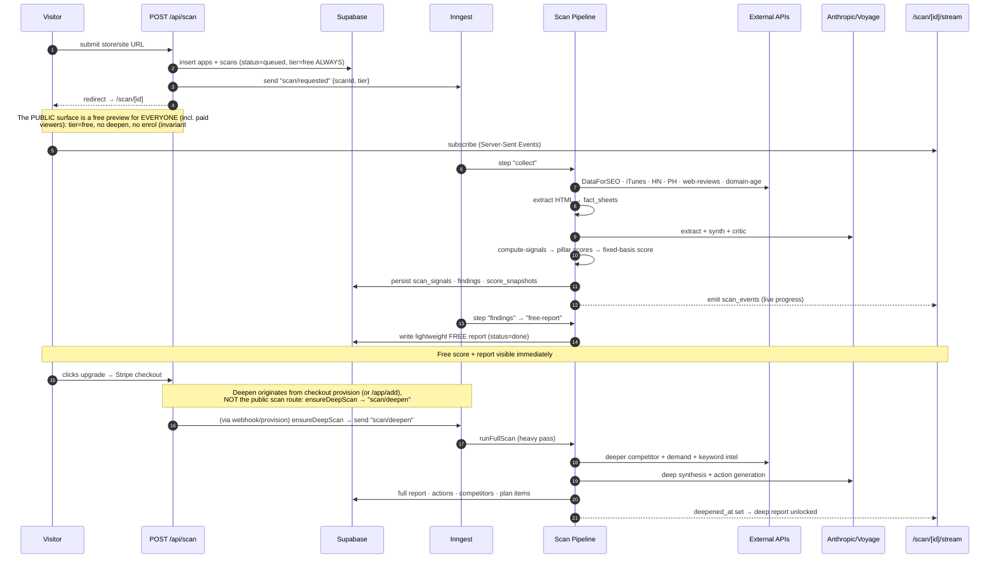
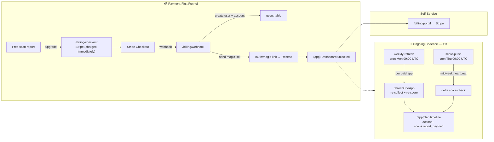

# ReachKit — Architecture, Data Flow & Processes

> Living architecture document. Update this as the system evolves.
> Last updated: 2026-07-11 (free-report conversion redesign: Search Visibility §6.0)

ReachKit is a single-stack Next.js 16 (App Router) application deployed on Vercel.
There is no separate backend service — API routes are thin, and all heavy /
long-running work is offloaded to **Inngest** background functions hosted at
`/api/inngest`. State lives in **Supabase** (Postgres + RLS + pgvector).

---

## 1. System Architecture & Data Flow

```mermaid
graph TB
    subgraph client["👤 Client (Browser)"]
        Visitor["Anonymous Visitor"]
        User["Authenticated User"]
    end

    subgraph vercel["▲ Vercel — Next.js 16 App Router"]
        subgraph routes["Route Groups"]
            MKT["(marketing)<br/>landing · /scan · /gallery<br/>/pricing · /teardowns/[slug]<br/>/tools/* · /compare/[slug]"]
            FUN["(funnel)<br/>/scan/[id] report<br/>Stripe→Email→Magic-Link wall"]
            APP["(app) — gated dashboard<br/>/app · /plan · /dashboard<br/>/demand · /supply · /synthesis<br/>/competitors · /billing"]
        end

        subgraph api["API Routes (app/api)"]
            AScan["/scan · /scan/[id]/stream<br/>/scan/[id]/checkout"]
            AApp["/app/intel · /app/[id]/refresh<br/>/app/[id]/queue · /voice"]
            ABill["/billing/checkout · /webhook<br/>/portal · /trial"]
            AAuth["/auth/magic-link"]
            AComp["/competitors/candidates · /select"]
            AAct["/action · /content-draft · /distribute"]
            AIng["/api/inngest (function host)"]
        end
    end

    subgraph core["⚙️ Core Libs (lib/)"]
        Pipeline["lib/scan — pipeline<br/>collect→extract→synth→critic→format"]
        Score["Scoring Engine<br/>SIGNAL_REGISTRY (~18 signals)<br/>3 pillars: SEO · Content · Outreach"]
        Adapters["lib/scan/adapters<br/>data collectors"]
        LLMlib["lib/llm — Anthropic<br/>extract · synth · critic · actions"]
        Deepen["lib/scan/deepen<br/>free → full/deep gate"]
    end

    subgraph jobs["🔄 Inngest (Background Jobs)"]
        JReq["scan/requested"]
        JDeep["scan/deepen"]
        JDemo["scan/demo.requested"]
        JVerify["action/verify"]
        JWeekly["weekly-refresh<br/>cron Mon 09:00"]
        JPulse["score-pulse<br/>cron Thu 09:00"]
        JClean["search-cache-cleanup"]
    end

    subgraph data["🗄️ Supabase (Postgres + RLS + pgvector)"]
        DBcore["apps · scans (report_payload)<br/>findings · actions · scan_signals<br/>score_snapshots · fact_sheets · scan_events"]
        DBintel["competitors (selection)<br/>demand_intel (read-through cache)<br/>search_cache (cachedJson blobs)"]
        DBinfra["users (billing state on-row) · pipeline_runs<br/>embeddings (pgvector) · public_scans (view)<br/>outcomes · evidence · raw_documents<br/>market_snapshots · monitors · distribution_profiles"]
    end

    subgraph ext["🌐 External Services"]
        Anthropic["Anthropic Claude<br/>(LLM synthesis)"]
        Voyage["VoyageAI<br/>(embeddings)"]
        DFS["DataForSEO<br/>backlinks · keywords · rank · traffic"]
        Tavily["Tavily (web search)"]
        Sources["Public sources<br/>iTunes/App Store · HN Algolia<br/>Product Hunt · YouTube · X<br/>G2 · Trustpilot · web.archive"]
        Stripe["Stripe (billing)"]
        Resend["Resend (email/magic-link)"]
        PostHog["PostHog (analytics)"]
    end

    Visitor -->|"submit URL"| AScan
    User --> APP
    APP --> AApp

    AScan -->|"insert app+scan<br/>send scan/requested"| JReq
    AScan -.->|"stream progress (SSE)"| FUN
    AApp --> Pipeline
    AComp --> Adapters

    JReq --> Pipeline
    JDeep --> Deepen --> Pipeline
    JDemo --> Pipeline
    JWeekly --> Pipeline
    JPulse --> Score

    Pipeline --> Adapters
    Pipeline --> Score
    Pipeline --> LLMlib
    Pipeline -->|"persist"| DBcore
    Deepen -->|"emit scan/deepen"| JDeep

    Adapters --> DFS
    Adapters --> Tavily
    Adapters --> Sources
    LLMlib --> Anthropic
    LLMlib --> Voyage
    Voyage --> DBinfra

    ABill <-->|"checkout · webhook · portal"| Stripe
    Stripe -.->|"webhook → create account"| AAuth
    AAuth --> Resend
    ABill --> DBinfra

    Pipeline --> DBintel
    api --> DBcore
    routes -.->|"read"| PostHog
    AIng -.hosts.-> jobs
```

---

## 2. Scan Flow — from URL to Report (two-tier: free → deep)

---

## 3. Accounts, Billing & Recurring Cadence (§11)

**Account lifecycle — self-serve export + hard-delete (launch P3b).** Settings offers
`GET /api/app/account/export` (whole-account JSON, `lib/account/export.ts`) and
`POST /api/app/account/delete` (irreversible hard-delete, `lib/account/delete.ts`).
Both target `requireUser().user.id` only — never a body/param — so a user can only
act on themselves. **Deletion is an explicit orchestration, not a DB cascade:** the
user↔apps link is the `users.app_ids[]` ARRAY (no FK), so deleting a `users` row
cascades to nothing. `deleteAccount` therefore (1) cancels the Stripe sub first
(never orphan a live sub billing a deleted account), (2) deletes the `auth.users`
row via the Admin API (no FK from `public.users`), (3) deletes `scans` by
`claim_email` (PII orphan — a scan claimed by the user whose app was never added to
`app_ids`), (4) deletes the `apps` in `app_ids` which CASCADE the whole app→scan
subtree, (5) deletes the `users` row. Global shared caches (`raw_documents`,
`fact_sheets`, `demand_intel`, `distribution_profiles`, `search_cache`,
`processed_stripe_events`, NULL-app `embeddings`) are content/domain-keyed cross-user
data and are deliberately untouched. Guards: `tests/integration/account-{delete,export}.test.ts`.

---

## 4. Data lineage — SOURCE → STORAGE → INTERPRETATION → UI

The map that answers "where does this number come from / why is this screen
blank?" without re-scanning. Read the per-scan **`/app/diagnostics`** page for the
live populated/empty state of any given scan.

### 4.1 Per-data-type lineage

| Data | Source | Storage | Interpretation | UI surface |
|------|--------|---------|----------------|------------|
| **Discoverability Score (headline, v5)** | HTML fetch (on-page) **×** ONE `ranked_keywords` call (search presence) — both free-computable | `scans.score_total` (`score_version 5`) | `discoverabilityScore(onPageReadiness, searchPresence)` = **geomean** of (a) `headlineScore` = `registryScore` over the FIXED 8 on-site signals (`FIXED_BASIS_SIGNAL_KEYS`) and (b) `searchVisibility.score`. Both drivers identical free↔paid → **the unified number never moves on upgrade**. Geometric so BOTH must be strong (a tidy page invisible in search reads low, e.g. 98 × 4 → 20). `searchPresence` floored at 1 | Dashboard/report gauge + **two driver bars** ("On-page readiness" · "Search presence") |
| On-page readiness (driver) | HTML fetch (page only — no off-site) | `scans.score_breakdown`, `report_payload.searchVisibility.onPageReadiness` | `compute-signals` → `headlineScore` = `registryScore` over the FIXED 8 on-site signals. UNCHANGED from v4 (still `HEADLINE_SCORE_VERSION=4`) | First driver bar; the on-site pillar bars |
| Pillar bars | on-site `scan_signals` | `scan_signals` | `headlineScore` → `pillarRollupFromRegistry`; Content + SEO assessed on-site, Outreach reads "off-site → Market Position" (no on-site signal) | Dashboard hero pillars (paid) |
| Market position | off-site `scan_signals` (keyword footprint, backlinks, marketplace/community/press) | `scans.report_payload.marketPosition` | `marketPositionScore` = `registryScore` over the NON-fixed (off-site) signals, cohort-relative where rivals exist | Dashboard hero ("Market position vs rivals"), paid only |
| **Search Visibility (free "wow")** | ONE subject `ranked_keywords` (footprint SAMPLE, top 50) + ONE `domain_rank_overview` (**TRUE** total keywords + organic ETV → `footprintComplete`) + ONE `search_volume` on the **LLM-authored category seed phrases** (`lib/llm/synth.ts` `categorySeeds`) | `report_payload.searchVisibility` (`search_cache` `rk:*`/`do:*`/`kv:*`) | `lib/scan/search-visibility.ts`: classify footprint brand/category/off-topic via the **shared** brand detector (`referral/brand-keywords.ts`, one detector for free + the paid keyword gap — RC1); **category demand = Σ exact volume of the LLM category seeds** (no keyword_ideas expansion noise), **every phrase rendered so the total reconciles** (G4); opportunities = category seeds you don't rank top-3 for. **No `capture` field** — it was the SV score aliased under a "you capture X%" label, deleted (G1). Sample %s carry `footprintComplete=false` (G2/G3). Works at 0 rankings (zero-state). ~$0.03 extra, ≤ ~20¢ free | Free report `/scan/[id]` hero SV panel + reconcilable category-demand phrases |
| Audience tags | LLM synth (`intendedAudience`/`actualAudience` on `positioningMirror`) | `findings_payload` → `report_payload.whatYouOffer.positioningMirror` | LLM-authored (replaced the old `splitTags` prose-chopping) | Free report "Positioning Mirror" |
| Per-scan cost | DataForSEO (real `body.cost`) · Tavily (credits × rate) · Anthropic (tokens) | `scans.dataforseo_cost_cents` / `tavily_cost_cents` / `cost_cents` | `lib/scan/cost-context.ts` (AsyncLocalStorage sink; `costedStep` flushes per Inngest step) | `/app/diagnostics` — per-scan breakdown + "Spend by user" (all users) |
| Competitors / referrers | DataForSEO backlinks + traffic | `search_cache` (`funnel2:*` cachedJson) + `report_payload` | `gatherFullFunnel` → `buildBreakdown` | Audience → Competitors |
| Keyword gap | DataForSEO ranked_keywords | `search_cache` (`synth:*`) + `report_payload.market.gap` | `gatherKeywordGap` | Audience → Keywords |
| Demand / pockets | Reddit/community search + keyword ideas | `search_cache` (`demand-intel:*`) **and** `demand_intel` table | `gatherDemand` | Audience → Customers |
| Buyer insights | competitor review mining (Tavily) + own reviews/community (2C fallback) | inside the demand payload | `mineCompetitorReviews` | Audience → Customers |
| Creators | YouTube adapter | `report_payload.creatorsToReach` | `find-creators` (brand-relevance gated) | Audience → Creators |
| Plan / actions | LLM synthesis | `actions` table + `report_payload.whatToDoThisWeek` | `synthesizeKeyActions` / action generation | Plan · Dashboard "this week" |

### 4.2 The `report_payload` contract (paid report = `scans.report_payload`)

The paid report is **not** a set of joined tables — it is the single
`scans.report_payload` JSON blob (type `ReportPayload`, `lib/scan/report.ts`),
plus the `cachedJson` blobs for the streamed `/app/audience/*` intel. Every
consumer null-coalesces (`?? []`) because reports persisted before a section
existed won't carry it. Top-level sections and who reads them:

| `report_payload.*` | Reader |
|--------------------|--------|
| `whatYouOffer.positioningMirror` | Report · "What you offer" |
| `whoItsFor.signals` | Audience → Customers |
| `whereTheyAre.surfaces` / `competitorGap` | Audience → Competitors |
| `whatToDoThisWeek.{quickWins,medium,longPlay}` | Plan |
| `score` (`VerifiedScore`) | Dashboard gauge |
| `marketPosition` | Dashboard hero (paid) |
| `competitiveLandscape` / `channelOpportunities` / `creatorsToReach` / `strengthsAndWeaknesses` | Audience tabs (light pass) |
| `market` (`MarketAnalysis`) | Dashboard intel blocks — **supersedes** the four light sections above when present |

> `results-screen` (public `/scan/[id]`) is the **teaser only** — always redacted.
> The real paid report is the `/app` intel dashboard. That's why paid-only grades
> (e.g. Market position) live in `DashboardHero`, not the public results screen.

### 4.3 The two cost points

Heavy metered spend (DataForSEO + LLM) fires at exactly two moments. **Both are
bounded to `MAX_SELECTED` (5) rivals** — the cost is capped, not open-ended:

1. **Deep scan** (`scan/deepen` → `runFullScan` → `runMarketAnalysis`) — profiles
   an auto-discovered top-5 cohort (full: backlinks + ranked keywords, needed for
   the gap/channel analysis) + demand sweep. Runs under `ScanBudget`
   (`env.scanBudgetCents`). The free pass is a lighter top-3 ETV-only variant.
2. **Competitor select** (`POST /api/competitors/select` → `gatherSynthesis`) —
   the full funnel + keyword-gap + demand + synthesis for the user's chosen cohort
   (~€1.2). `gatherSynthesis` hard-caps its cohort at `MAX_SELECTED`, and every
   downstream gatherer (`cohortFor`, `gatherFullFunnel`, `gatherDemand`) caps too.

**Overlap is de-duped by the per-domain caches** (`cc:*`, backlinks, ranked-kw,
profile): re-selecting a rival the deep scan already profiled costs nothing, so
the "double-cohort" cost only ever applies to *new* domains the user adds. Making
the deep-scan cohort light to avoid re-profiling was deliberately **not** adopted —
the deep market analysis needs full backlink profiles, and the caches already
eliminate the redundant spend.

**LLM spend attributes through the SAME context (2026-07-15).** `callModel`
(`lib/llm/anthropic.ts`) records a `pipeline_runs` row per call, keyed by scanId —
but the scanId was an explicit argument, and many generators passed
`scanId: null` (both draft generators, the whole synthesis gather, referral
funnel). Those wrote `pipeline_runs.scan_id = NULL`: **real Anthropic money that
rolled up to no scan and therefore to no user.** The cost sink now carries the
scanId and `currentScanId()` exposes it, so `callModel` falls back to the ambient
costed step (`args.scanId ?? currentScanId()`). Consequence: wrapping a route in
`costedStep`/`costedIntelStep` now attributes its **LLM *and* data** spend in one
move — which is why the two paid draft routes (`/api/content-draft`,
`/api/distribute/draft`) are now wrapped and pinned in the `costed-routes` tripwire.
Guard: `lib/scan/cost-context.scanid.test.ts`.

**External spend is now measured per scan and per user** (`lib/scan/cost-context.ts`).
DataForSEO returns the exact USD charged in every v3 response envelope (`body.cost`);
all reads funnel through one `dfsJson(res)` choke point that parses **and** records
it. Tavily returns no cost (it bills in credits), so it's priced deterministically
from the request shape (search basic=1 / advanced=2 credits; extract 1 per 5 URLs) ×
`TAVILY_USD_PER_CREDIT`. An `AsyncLocalStorage` sink attributes cost to the running
scan from any adapter depth without threading `scanId`; each cost-bearing Inngest
step (`collect`/`findings`/`free-report`/`full-scan`/`deepen`) runs under `costedStep`
and additively flushes its delta to `scans.{dataforseo,tavily}_cost_cents`
(replay-safe; cache hits never reach the adapter so they record nothing). The
recurring + interactive callers are costed too: weekly/manual refresh via
`costedStep` on the latest scan row, and the four intel/competitor routes via
`costedIntelStep` (`lib/app/latest-scan.ts` — also emits a source-tagged
`intel-spend` scan event when real spend occurred). Guard:
`app/api/costed-routes.test.ts` fails if any caller drops its wrapper. Per-user
total = LLM + DataForSEO + Tavily summed over `users.app_ids` → `scans.app_id`
(`loadAllUsersSpend`) plus the month-bucketed `user_spend_monthly` view, shown on
the owner-only `/app/diagnostics`.

Cold-scan reality (trustmrr, 2026-07-09, fully cache-purged): **free ≈ $0.10**
(LLM $0.08 · DataForSEO $0.002 · Tavily $0.016); **paid deep, cumulative ≈ $0.56**
(LLM $0.15 · **DataForSEO $0.35** · Tavily $0.06). DataForSEO Labs (ranked_keywords /
relevant_pages / domain_rank_overview across the cohort) is the dominant external
cost — the old "~€1.2" gather estimate was conservative. **External spend is now
SOFT-CAPPED per scan** (invariant #2): `EXTERNAL_SCAN_CAP_CENTS_FREE=25` /
`EXTERNAL_SCAN_CAP_CENTS_FULL=150`. The cap is cumulative across steps
(`costedStep` subtracts already-flushed spend from each step's headroom). On
breach `recordExternalCost` flips the sink's `breached` flag — it **never
throws** (degrade, never invent); `runFullScan` checks `externalCapBreached()`
before the market pass and skips it (the existing `market:null` degraded path
renders), and the scan row is stamped `external_cap_hit_at` on flush. LLM spend
remains bounded by `ScanBudget`'s cent-caps + the tool-call ceiling.

### 4.4 Single-source-of-truth rule (retired dead tables)

Every intel gatherer once wrote a typed table **and** a `cachedJson` blob, but the
UI only ever read the blobs + `report_payload`. Those typed tables were pure
write cost. **Rule: intel is canonical in `report_payload` + `cachedJson`; do not
add a typed per-domain intel table unless something reads it back.**

Retired (migration `20260708120000`): `keyword_gap`, `demand_pocket`,
`content_plan_item`, `distribution_plan_item`, `cohort_competitor`,
`domain_intel`, `domain_content_page`.

Kept — and the ONE exception, because it IS read back: **`demand_intel`**, a
cross-scan read-through cache. On a `demand-intel:*` JSON-cache miss,
`readDemandIntelFallback` serves a fresher-than-TTL row before paying for a full
gather (and refuses a row with empty buyer insights so blanks don't persist for
the 7-day TTL).

---

## 5. Scan pipeline — step-by-step logic (free vs deep)

> Traced from code 2026-07-10 (`scan-requested.ts`, `scan-deepen.ts`, `full-scan.ts`,
> `free-report.ts`, `collect.ts`, `findings-pipeline.ts`). The **free** and **deep**
> passes share one collect+findings prefix and one report renderer; they diverge at
> the report step. The paid scan and the deepening scan are the *same* work
> (`runFullScan`) reached from two triggers.

### 5.1 FREE pass — `scan/requested` with `tier="free"` (the lead magnet)

Purpose: a conversion-driving "wow" that reveals a credible search gap. On-site score
is measured from the already-fetched HTML; the free report ALSO makes two cheap
subject-only DataForSEO calls (`ranked_keywords` + `search_volume`) to compute
**Search Visibility** — the conversion engine (§6.5). Total ≤ ~20¢/scan.

| # | Step (Inngest) | Does | Cost |
|---|---|---|---|
| 1 | `collect` (`scan-requested.ts:44`) | `runCollect` → `getListing` (**site HTML fetch** = the sole source for the 8 headline signals + domain age), `getReviews` (**Tavily** `"{host} reviews"`), `findCompetitors` (**DataForSEO SERP + ProductHunt + Tavily**), then `extractCompetitorNames` (**Haiku**) to recover real names → `facts.competitors` | 3 external calls + 1 Haiku |
| 2 | `findings` (`:99`) | `runExtract` (Haiku fact sheets) → `runSynth` (**tier-aware model**, `synthModelForTier`: free → **Haiku 4.5**, paid → **Sonnet**): positioning mirror + findings + **`categorySeeds` (head category search phrases) + `intendedAudience`/`actualAudience`** (LLM-authored, persisted to `findings_payload`) → v1 score | 3–4 Haiku + 1 synth |
| 3 | `free-report` (`:147`) | `runFreeReport`: `headlineScore` over the 8 `FIXED_BASIS_SIGNAL_KEYS` (on-page driver) → **`gatherFreeSearchVisibility`** (`ranked_keywords` footprint + `search_volume` on the LLM `categorySeeds` → `report_payload.searchVisibility`) → **`discoverabilityScore(head, sv.score)` persisted as `score_total` (`score_version 5`)** → `fallbackActionsFromSignals` → `buildFreeReport` | + ~2 DataForSEO calls (~$0.04) |
| 4 | `done` (`:218`) | emit done, status `done` | — |

Render: `/scan/[id]` → `PublicReport` → **always** `redactReportForTier(payload,"free")`
→ `ResultsScreen`. Free "wow" surface = score gauge + band, 3 pillar bars, top-3
ranked fixes (locked-count + worth), positioning gap, a search-gap table, unlock CTA
+ shareable badge. **Caveat (see §6):** Outreach pillar is always `unmeasured` on
free and the keyword-gap table + Market Position are paid-only, so the teaser's most
persuasive off-site surfaces render empty.

Free budget: `ScanBudget{ maxToolCalls:60, budgetCents:20 }` (`FREE_SCAN_BUDGET_CENTS`, raised 15→20 for Search Visibility). Abuse: 10 scans /
IP-hash / hour, 15-min in-flight dedupe (`abuse.ts`). Cold-scan cost ≈ **$0.10**.

### 5.2 DEEP / PAID pass — `runFullScan` (`full-scan.ts:485`)

Reached two ways, same code: **(a)** `scan/requested` with `tier="full"` — from the
**in-app** paths only (`/app/add`'s `startScan`, `/api/app/scan-current`); the PUBLIC
`/api/scan` is always `tier="free"` (invariant #12), **(b)** `scan/deepen` via
`ensureDeepScan` — flips `scans.tier→full`, reuses stored `preliminary_facts` (no
re-collect), fired from Stripe checkout provisioning (`provision.ts:116`) or the
in-app `/app/add` deepen/attach. Idempotent via `hasDeepReport` (sentinel
`scans.deepened_at`).

**Synth-model note (2026-07-19):** the deep pass **reuses the free scan's
`findings_payload`** (it re-extracts only `keyword_data`, not synth) and feeds those
findings into `generateActions` (`:528`). Because the free findings step now runs
synth on **Haiku** (`synthModelForTier`), a scan deepened *from a free scan* builds
its paid action plan from Haiku-authored findings; a **paid-from-start** scan
(`tier="full"` at the findings step) uses **Sonnet**. If the paid plan must always
be Sonnet regardless of entry, the deep pass should re-run the full Sonnet synth
before `generateActions` (follow-up — deliberately not done yet, pending the Haiku
quality A/B).

Ordered steps (all skipped on free): 1 `runFullCollect` (keywords/communities/creators,
seeded from `facts.competitors`, cap 5) · 2 re-extract `keyword_data` only · 3 read
findings · 4 grounding readers (persisted data, reused for assembly) · 5
`generateActions` (**Haiku**, over-generate ≥3/category) or cold-start · 6 `runCriticGate`
→ `algorithmSafety` (§11) · 7 verified score · 8 action floor to `MIN_ACTIONS=5`
(`market:null`) · 9 deep report readers · 10 assemble + persist · 11
**`attachMarketAnalysis`** (`profileCohort` auto-discovers a *second*, SEO-derived
cohort + `discoverDemand` 8-query pain sweep + keyword gap + plan + news) · 12 market
snapshot · 13 **market-aware re-floor** (recompute signals *with* market, top up plan
again) · 14 `persistActions` (delete+insert) · 15 score flip: `deepened_at`,
`persistScanSignals`, `discoverabilityScore(headlineScore, searchVisibility.score)` (v5, identical to free — 10a reuses persisted `searchVisibility`), `marketPositionScore`
(off-site grade) · 16 snapshots + `seedMonitors` + emit. Cumulative cold cost ≈ **$0.56**
(DataForSEO $0.35 dominant).

### 5.3 The score/plan model both passes share

- **Headline** = `registryScore` over the 8 fixed on-site signals only → identical
  free↔paid (invariant #1). **Market Position** = `registryScore` over the *other* 10
  off-site signals → paid only. No LLM in scoring; all deltas deterministic **except**
  action `expectedOutcome.delta` (see §6).
- **Short vs long** is derived at assembly by **`bucketActions`** from **time-to-
  PAYOFF** (PR C, `horizonFor`): outreach + earned-media (`new`-source) → longPlay;
  other off-site (`wire`) → medium; on-page content/SEO → quickWins (medium if the
  model estimated real effort). This replaced the old time-to-DO (`effortMin`) split,
  which could never populate longPlay (LLM effort clamped ≤90 < the >120 bucket).
  A *second* sequencer — **`plan-schedule.ts`** (the `/app/plan` timeline) — paces
  actions over a rolling 30-day calendar (weekly budget 300 min, ≤4/week); it is a
  different *view* (dated calendar) of the same actions, deliberately not merged.

### 5.4 Ongoing cadence

`weekly-refresh` (Mon 09:00) → `runWeeklyRefresh` (delta refresh, **appends**
actions, budget 120¢) · `score-pulse` (Thu 09:00) → free own-site recompute ·
`action/verify` → re-score snapshot after a user marks an action done.

---

## 6. Known inefficiencies & simplification ledger

> Surfaced by a full code crawl 2026-07-10. Ordered by impact on the two macro
> goals: **free = instant off-site "wow"**, **paid = trustworthy short+long-term
> actions that move the score over time**. Not yet actioned — this is the map.

### 6.0 Free report — conversion redesign ✅ SHIPPED 2026-07-11

Item #1 below (free under-delivers) is **resolved**. The free report is now a
conversion funnel built on **Search Visibility** (`lib/scan/search-visibility.ts`):
the LLM (`synth.ts`) names the site's category (`categorySeeds`) + audience tags;
`ranked_keywords` gives the footprint (brand / category / other-brands split);
`search_volume` on the seeds gives **real category demand**; capture = the SV score;
opportunities = the category searches you don't win; rivals are named with a
per-rival-share paid tease. Works for every use case — verified live by headless
render on **trustmrr.com** (directory: 590/mo, own 4%, "88% other brands"),
**nudgi.ai** (0-rankings zero-state: "Google ranks you for 0 · category 23,610/mo"),
and **cal.com** (leader: SV 85). Coherence fixes: killed the `splitTags` garbage
(LLM audience tags), one Search-Visibility gate (zero-state renders), off-topic
noise removed, hero no longer contradicts itself ("Well-built page" not "Highly
discoverable"). **Rule: never fabricate a number** — the LLM identifies the
category, DataForSEO supplies volumes; when a call flakes we degrade, never invent.
≤ ~20¢/scan. **Verification is by headless render of the live page, not the DB
payload** (the process fix — DB-only checking is what let the drift through).

### 6.1 Macro gaps (the value line is misplaced)

1. ~~**Free under-delivers its own promise.**~~ ✅ **RESOLVED** (§6.0). The 8 headline
   signals contain **zero
   Outreach signals** (5 SEO on-site + 3 Content), so free shows SEO+Content only;
   Outreach renders "Not measured". The keyword-gap table (`market.gap.keywordGap`)
   and Market Position are computed only on the deep pass, so the single most
   persuasive surface — *"buyers search X, your rivals rank, you don't"* — is entirely
   paid-gated and the free teaser renders it empty (`to-results-props.ts:90,100`).
   **Fix direction:** give free ONE bounded off-site proof (e.g. top-3 keyword-gap
   rows) — either a small metered DataForSEO call on free or reuse of the SERP/
   competitor data already fetched in `collect`.
2. **"Long-term wins" bucket is unreachable by real actions.** LLM `effortMin` is
   clamped to ≤90 (`actions.ts:123`) but `longPlay` requires >120 (`report.ts:159`),
   so *no generated action can ever be a long play* — `longPlay` only ever holds
   deterministic `new`-source floor cards (180 min). Align the thresholds and/or
   bucket by **time-to-payoff**, not time-to-do, so paid gets a genuine short↔long mix.
3. **Two competing "plan" models.** `bucketActions` (effort buckets in the report)
   and `plan-schedule.ts` (the 30-day timeline) are independent. Collapse to one:
   make the report buckets a *view* of the scheduled plan.

### 6.2 Trust / correctness

4. **LLM-invented impact points.** `generateActions` asks the model for
   `expectedOutcome.delta: <integer 1–15>` (`prompts.ts:241`) — ungrounded — while
   floor cards compute `delta = pillarWeight × signalWeight × (100−normalised)`
   (`fallback-actions.ts`). The same field means "real modelled points" for one and
   "a number the model picked" for the other, and both **sort the action board**
   (`action-board.ts:139`). Worse, on verification the invented delta is stored as
   `observed_delta` though nothing was observed (`verify.ts:234`); the real gauge moves
   from a full recompute. **Fix:** compute every delta from the signal model; drop the
   LLM's number.
5. ~~**Per-category floor (invariant #5) is enforced only in the eval harness**~~ —
   ✅ RESOLVED by PR A (2026-07-10): `ensurePerCategoryFloor` is runtime-wired in
   `full-scan.ts` at both floor points (see §6.5 PR A row + CLAUDE.md invariant #5).

### 6.3 Entitlement / cost-safety leaks

6. ~~**`/api/app/intel` + `/api/app/intel/stream` have no `assertPaid`**~~ —
   ✅ RESOLVED by PR A (2026-07-10): `assertPaid` now guards `/api/app/intel`,
   `/api/app/intel/stream`, `/api/competitors/select`, `/api/competitors/candidates`
   (CLAUDE.md invariant #5b; source tripwire `app/api/entitlement-gates.test.ts`).
7. **`ScanBudget` cent-cap doesn't bound what the docs claim.** Invariant #2 says
   "cents track LLM only," but `callModel` never calls `budget.charge` — only
   DataForSEO/Tavily tool calls charge a hardcoded `cents:1`. So `BudgetExceededError`
   can never trip on LLM overspend, and the 20¢/250¢ caps bound a slice of *external*
   tool count, not LLM. Reconcile the doc or wire real LLM cost into the budget.
8. **Dormant trial infra.** `entitlementsFor` honours `status==="trialing"` and the
   webhook wires `trial_will_end`, but both checkout builders set **no**
   `trial_period_days` ("charged immediately"). No subscription ever reaches
   `trialing`; the trial code is unused. `EntitlementError` also returns 403 on
   `/distribute/draft` vs 402 everywhere else.

### 6.4 Duplicated / redundant work

9. **Two competitor sets, never reconciled.** Free collect builds `facts.competitors`
   via `extractCompetitorNames` (LLM); the deep market pass **ignores it** and
   auto-discovers its own cohort via `discoverCompetitorsSmart` (DataForSEO
   domain-intersection). One scan reasons over two different rival sets; de-dup is
   per-domain cache only, not logical.
10. **`discoverDemand` runs twice, billed twice.** Deep pass (`gap/run.ts:45`) and
    competitor-select `gatherSynthesis→gatherDemand` (`demand/gather.ts:318`) both run
    the community pain sweep for the same subject; the cohort is profiled up to **3×**
    (`profileCohort`, `cohortFor`, `gatherFullFunnel`). Caches blunt external spend;
    the LLM clustering is fresh each path.
11. **Signals recomputed 3× per deep pass** (§6b floor, market-aware re-floor,
    `persistScanSignals`) and **twice on free** (`computeSignalRowsForScan` then
    `persistScanSignals` re-derives). Thread the computed rows through instead.
12. **Two divergent action writers.** `persistActions` (deep) does delete+insert,
    wiping action lifecycle state on re-deepen; `weekly-refresh` appends+dedups AND
    drops `signal_keys`/`target` (`refresh.ts:544`), so weekly actions can't be
    signal-attributed or scheduled. Unify.
13. **`audienceProxy` always 0** — the YouTube 2nd `videos.list` call is never made;
    creator reach is a placeholder.

### 6.5 Forward plan (approved 2026-07-10) — iterate forward, don't re-diagnose

The §6 findings are the diagnosis; this is the cure. **Sequenced into 4 PRs.** Two
hard cost gates are acceptance criteria on *every* PR (measured via
`/app/diagnostics` per-scan cost + the `[scan-complete]` log): **free scan ≤ ~$0.18**
(raised from $0.10 by decision 2026-07-10 to fund PR B's one subject-only
`ranked_keywords` call — the real free keyword-gap "wow" was judged worth ~+$0.06;
rivals' ranks stay a paid reveal), **paid deep scan ≤ ~$1.00** cumulative. A PR that
breaches either is not done.
UI-visible PRs (B, C) require a **Claude Design sync** (edit live component → update
`.design-sync/ds-src` mirror → `build.mjs`+`layout.mjs` → `/design-sync` → `pnpm
bless:design`) in the same change, per CLAUDE.md "Keeping Claude Design and the code
in EXACT sync".

| PR | Scope (§6 items) | UI? | Cost effect | Sync |
|---|---|---|---|---|
| **A — Trust + gate** ✅ *landed 2026-07-10* | #4 model-computed impact (`recomputeActionImpacts`/`modelledImpact` in `action-linking.ts`, wired at both floor points in `full-scan.ts`; `verify.ts` `observed_delta` now stores the REAL new−prior gauge movement) · #5 per-category floor in prod (`ensurePerCategoryFloor`) · #6 `assertPaid` on `/api/app/intel(+/stream)` + `/api/competitors/{select,candidates}` | numbers only, no structure | neutral (removes a leak → *reduces* rogue spend) | none |
| **B — Free "wow"** ✅ *superseded 2026-07-11* | #1 real proof on free. The original keyword-teaser implementation (`lib/scan/free-keyword-teaser.ts` → `report_payload.freeKeywordTeaser`) was **deleted and superseded by Search Visibility** (`lib/scan/search-visibility.ts` → `report_payload.searchVisibility`, §6.0): same ONE subject-only `ranked_keywords` primitive, but scored (capture %) and category-seed-grounded; rivals' ranks still locked to paid | `ResultsScreen` SV hero | ≤ ~$0.18 measured live | **done** |
| **C — One plan model** ✅ *landed 2026-07-10* | #3/#2 `bucketActions` now buckets by **time-to-payoff** (`horizonFor` in `report.ts`): outreach + earned-media → longPlay, off-site `wire` → medium, on-page → quick. Makes "long-term wins" real (the old effort split could never fill longPlay) and moots the clamp/bucket mismatch. **Literal merge with `plan-schedule.ts` deliberately NOT done** — the report's 3-bucket horizon and the dated calendar are different views of the same actions | dashboard "this week" ordering only (structure unchanged → no card redesign) | neutral | none needed (bucketing logic, not layout) |
| **D — Cohort/demand dedup** 🟡 *#12 landed 2026-07-10; #9/#10/#11 deferred* | ✅ #12 unified the action writers — `refresh.ts` now links signals + recomputes honest deltas + persists `signal_keys`/`target` (parity with `persistActions`), so weekly actions are schedulable + attributable. ⏸️ #9 one canonical cohort, #10 one `discoverDemand`/scan, #11 no 3× signal recompute — **DEFERRED**: these refactor the paid billing path and MUST be live-verified (`REACHKIT_USE_FIXTURES=false`, a real paid deep scan) before trusting — shipping them blind risks the very cost regressions this plan targets | none | #12 neutral; #9/#10 reduce paid cost when done | none |

Guards added by PR A (ratchet): `action-linking.test.ts` (`recomputeActionImpacts`,
`modelledImpact`, `ensurePerCategoryFloor`) and `app/api/entitlement-gates.test.ts`
(source-level tripwire — fails if any of the 4 cost-bearing authed routes drops its
`assertPaid`).

### Source tripwires — and the helper that keeps them honest (2026-07-15)

Several invariants are enforced by **source tripwires**: tests that read a source
file and assert it calls a required symbol. They exist because the thing being
protected is *structural* — "this route must be wrapped in `costedStep`", "this
caller must go through the shared policy" — and a behavioural test can't see a
caller that quietly stops calling.

| Tripwire | Pins |
|---|---|
| `app/api/costed-routes.test.ts` | Every cost-bearing route runs under `costedStep`/`costedIntelStep` (invariant #2). |
| `app/api/entitlement-gates.test.ts` | The 4 cost-bearing authed routes call `assertPaid` (invariant #5b). |
| `app/api/add-product-policy.test.ts` | `/api/scan` + `addTrackedProduct` both resolve through `resolveProductScan` — the ONE dedupe policy — and `addFirstTrackedProduct` stays retired. |
| `app/api/no-scan-ejection.test.ts` | No `app/(app)/**` or `components/app/**` surface links to `/scan/` (a paid user must never be ejected into the entitlement-blind `PublicReport`). |

**All positive-call tripwires MUST assert via `expectCallsSymbol` (`lib/testing/tripwire.ts`).**
A hand-rolled `readFileSync` + `toMatch(/symbol/)` is how this repo shipped two
**vacuous** guards: `lib/app/add-product.ts` *defines* `resolveProductScan`, so a
whole-file match was true by construction; and the route half passed 3/3 with the
real call deleted and only the import left. The helper blanks comments/strings,
brace-matches the named function's own body (`within`), demands a real call, and
**throws** rather than let you assert a symbol against a file that defines it —
the vacuum is structurally impossible, not merely discouraged. Its self-test
(`lib/testing/tripwire.test.ts`) reproduces the exact false-negative that shipped.

`lib/testing/` is test-support only and is imported by tests (app→lib, allowed by
`check:arch`). It must never be imported by production code.

Order rationale: A first — smallest, cost-neutral, and honest impact numbers are a
prerequisite for B and C both surfacing deltas. D last — pure dedup/refactor, safe to
land once behaviour is settled. #7 (ScanBudget LLM-cents doc vs reality) and #8
(dormant trial infra) are reconciliation notes, folded into whichever PR touches that
file; #13 (`audienceProxy`) stays deferred.

---

## Key architectural notes

- **Single stack, no separate backend** — everything runs on Vercel as Next.js
  App Router (Fluid Compute). API routes are thin; heavy work is offloaded to
  **Inngest** functions hosted at `/api/inngest`.
- **Observability (launch P4)** — server errors report to PostHog error tracking
  via `lib/analytics-server.ts` (`posthog-node`, server `POSTHOG_KEY`, fail-safe
  no-op when unconfigured): `captureServerException` is wired into the shared scan
  pipeline-failure handler (`lib/scan/terminal-status.ts`) + every Inngest
  `onFailure`. Client render errors report through the consent-gated client
  `captureException` from the three error boundaries (`app/error.tsx`,
  `app/(app)/error.tsx`, `app/global-error.tsx`). `GET /api/health` is the
  DB-reachability probe. `SCANNING_ENABLED=false` is the runtime kill switch at
  the scan entrypoints (HTTP `/api/scan` + `/api/app/[id]/refresh` → 503; the
  weekly-refresh + score-pulse crons skip their fan-out). Cost alerts fan out from
  `persistCostAlert` to a PostHog `cost_alert` event + optional
  `COST_ALERT_WEBHOOK_URL`. Conversion funnel: `scan_started` → `scan_facts_shown`
  → `scan_findings_shown` → `paywall_viewed` → `checkout_started` (client) →
  `subscription_activated` (server, from the Stripe webhook).
- **Two-tier scan** — a fast, free lightweight report is produced first
  (`lib/scan/free-report.ts`), then `scan/deepen` runs the expensive full pass
  (`lib/scan/full-scan.ts`) only after payment. The headline gauge is the
  **unified Discoverability Score** (`score_version 5`) = `discoverabilityScore` =
  geomean of **on-page readiness** (`headlineScore`, the fixed on-site basis) **×**
  **search presence** (`searchVisibility.score`). Both drivers are free-computable
  and measured identically on both tiers, so the number is stable free→paid — but
  it's honest: a tidy page invisible in search scores low (98 × 4 → 20). The deep
  pass's off-site cohort strength surfaces as the separate **Market Position**
  grade, never in the headline. (v4 was on-page-only — stable but dishonestly high
  for unfound sites; PR #36's v3 folded in *paid-only* off-site signals and dropped
  the score on upgrade. v5 folds in only the *free* search-presence half. See §4.1.)
- **Scoring engine** — `SIGNAL_REGISTRY` in `lib/scan/signals.ts` drives ~18
  deterministic (no-LLM) signals grouped into 3 weighted pillars
  (**SEO 0.45 / Content 0.30 / Outreach 0.25**), persisted to `scan_signals` +
  `score_snapshots`. `score-full.ts` produces the verified anti-vanity score +
  7-axis radar for the paid pass.
- **Data layer** — Supabase Postgres with RLS on all tables, `pgvector` for
  embeddings (via VoyageAI), and a JSON `search_cache` layer (the `cachedJson`
  blobs) over DataForSEO/LLM output. **Single source of truth:** the paid intel
  UI reads `scans.report_payload` + the `cachedJson` blobs — NOT typed per-domain
  tables. The only typed intel tables still live are `competitors` (the user's
  saved selection) and `demand_intel` (a read-through cache; see §4). Seven
  write-only "dead" intel tables were retired (migration
  `20260708120000_retire_dead_intel_tables.sql`). `public_scans` is a view
  feeding the `/gallery` page + landing ticker.
- **The gallery keeps EVERY scan on purpose — do not "clean up" test/free/low rows.**
  (Owner decision, 2026-07-17.) `public_scans` deliberately carries test scans, free
  scans and low scorers: **volume is the credibility**, so a fuller gallery is the
  goal, not a tidier one. A low score for our OWN product is *honest reality for an
  early startup*, not a bug to hide — `reachkit.app` sits there at 9/100 next to
  `plausible.io` at 96 by choice. This is written here because the instinct on
  seeing those rows is to delete them, and that instinct is wrong: pruning the
  gallery is a REGRESSION. If a scan must be hidden, that is a new product
  requirement needing its own decision — never a cleanup pass.
- **Background cadence** — `weekly-refresh` (cron Mon 09:00 UTC) and
  `score-pulse` (cron Thu 09:00 UTC) drive the recurring §11 cadence that feeds
  the `/app/plan` timeline; `search-cache-cleanup` (cron daily 03:00 UTC) prunes
  `search_cache` rows older than 30 days.
- **Two funnel paths** — Path A (scan-first): free report → `/scan/[id]/checkout`;
  Path B (direct checkout): `/billing/checkout/anonymous` anonymous checkout with no
  prior scan (renamed from the legacy `/billing/trial` 2026-07-16; there is **no free
  trial** — `checkout.ts` sets no `trial_period_days`; plans are charged immediately).
  Both converge on the Stripe webhook → account provision → magic link.
- **ONE post-checkout provisioning policy** (2026-07-17) — `checkout.session.completed`
  has two *shapes*, never two branches: the **legacy in-app upgrade** (`metadata.userId`,
  from `createCheckout`; user exists and is logged in → resolve by id, `sendMagicLink:false`,
  carries no `scanId`) and the **payment-first funnel** (anonymous; create-or-find from the
  Stripe email → `sendMagicLink:true`). Both then run the *same* `provisionCheckoutUser`:
  bind ids → link the session scan (if any) → **`deepenOwnedScans(userId)`** → conditional
  link. Two things this fixes, both invisible from the symptoms:
  - The branches had drifted so only the payment-first one deepened — the legacy branch
    returned before `provisionCheckoutUser`, the sole caller of `ensureDeepScan`. A
    logged-in free user upgrading from the paywall got **no deep pass, ever**. The legacy
    checkout carries no `scanId`, so the deepen target must be resolved by **ownership**
    (latest completed scan per tracked app, `ensureDeepScan`-idempotent).
  - The onboarding magic link is gated on the **recorded** `users.onboarding_link_sent_at`,
    never inferred. It used to infer "redelivery" from `stripe_customer_id` being bound —
    but `customer.subscription.*`'s defensive create binds that column too while deferring
    the email to the checkout handler. Stripe does not guarantee ordering, so a
    subscription-first delivery meant **neither half sent it**: paid, no way to log in.
    (`ensureAuthUser`-created-the-account is poisoned identically — both proxies lie.)
  Guards: `webhook.test.ts` (both shapes provision), `provision.test.ts` (ownership deepen,
  the subscription-first race, caller opt-out) — all mutation-proven.
- **External-API cost tracking** — DataForSEO + Tavily spend is measured per scan
  (`lib/scan/cost-context.ts` → `scans.{dataforseo,tavily}_cost_cents`) and rolled
  up per user (`loadAllUsersSpend`), surfaced on the owner-only `/app/diagnostics`.
  DataForSEO reports real USD; Tavily is priced from credits × `TAVILY_USD_PER_CREDIT`.
  Soft-capped per scan (free 25¢ / paid 150¢) — breach degrades the pipeline and
  stamps `scans.external_cap_hit_at` (see §4.3).
- **`/app` soft-nav** — link internal navigation straight to `/app/dashboard`, never
  the bare `/app` (which server-redirects there). A client soft-nav to a redirecting
  route aborts its in-flight RSC stream → `Error: Connection closed` in the `(app)`
  error boundary. `/app/page.tsx` keeps its redirect only as a safety net for direct
  hits (hard loads redirect cleanly).
- **Feature flags** — reduced to only `REACHKIT_USE_FIXTURES`, which runs the
  whole pipeline keyless (no external API calls) in dev/test.

## Directory map (high level)

| Path | Responsibility |
|------|----------------|
| `app/(marketing)` | Public site: landing, /scan, /gallery, /pricing, tools, teardowns |
| `app/(funnel)` | Scan report + payment/email/magic-link wall |
| `app/(app)` | Gated product dashboard (plan, demand, supply, synthesis, competitors, billing) |
| `app/api` | Thin API routes (scan, billing, auth, competitors, action, inngest host) |
| `lib/scan` | Scan pipeline, scoring engine, adapters, deepen gate, reports |
| `lib/scan/adapters` | External data collectors (DataForSEO, Tavily, iTunes, HN, PH, YouTube, X, web-reviews) |
| `lib/llm` | Anthropic synthesis (extract, synth, critic, actions) + Voyage embeddings |
| `lib/inngest` | Inngest client + background functions |
| `lib/db` | Supabase client + generated types |
| `lib/billing` | Stripe integration |
| `lib/auth` | Magic-link auth |
| `lib/email` | Resend transactional email |
| `supabase/migrations` | Postgres schema + RLS migrations |
