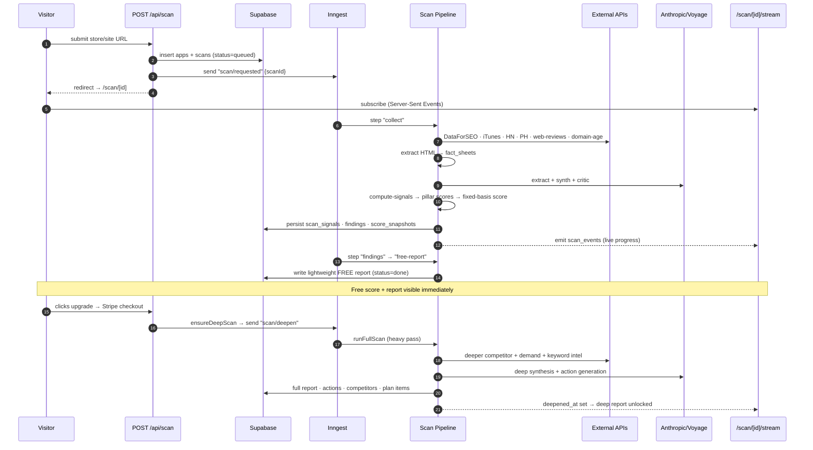
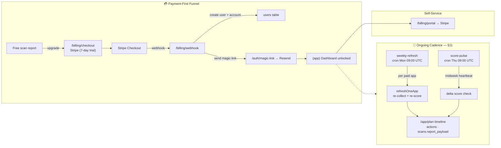

# ReachKit — Architecture, Data Flow & Processes

> Living architecture document. Update this as the system evolves.
> Last updated: 2026-07-10 (added §5 step-by-step scan logic + §6 inefficiency ledger)

ReachKit is a single-stack Next.js 16 (App Router) application deployed on Vercel.
There is no separate backend service — API routes are thin, and all heavy /
long-running work is offloaded to **Inngest** background functions hosted at
`/api/inngest`. State lives in **Supabase** (Postgres + RLS + pgvector).

---

## 1. System Architecture & Data Flow

```mermaid
graph TB
    subgraph client["👤 Client (Browser)"]
        Visitor["Anonymous Visitor"]
        User["Authenticated User"]
    end

    subgraph vercel["▲ Vercel — Next.js 16 App Router"]
        subgraph routes["Route Groups"]
            MKT["(marketing)<br/>landing · /scan · /gallery<br/>/pricing · /teardowns/[slug]<br/>/tools/* · /compare/[slug]"]
            FUN["(funnel)<br/>/scan/[id] report<br/>Stripe→Email→Magic-Link wall"]
            APP["(app) — gated dashboard<br/>/app · /plan · /dashboard<br/>/demand · /supply · /synthesis<br/>/competitors · /billing"]
        end

        subgraph api["API Routes (app/api)"]
            AScan["/scan · /scan/[id]/stream<br/>/scan/[id]/checkout"]
            AApp["/app/intel · /app/[id]/refresh<br/>/app/[id]/queue · /voice"]
            ABill["/billing/checkout · /webhook<br/>/portal · /trial"]
            AAuth["/auth/magic-link"]
            AComp["/competitors/candidates · /select"]
            AAct["/action · /content-draft · /distribute"]
            AIng["/api/inngest (function host)"]
        end
    end

    subgraph core["⚙️ Core Libs (lib/)"]
        Pipeline["lib/scan — pipeline<br/>collect→extract→synth→critic→format"]
        Score["Scoring Engine<br/>SIGNAL_REGISTRY (~18 signals)<br/>3 pillars: SEO · Content · Outreach"]
        Adapters["lib/scan/adapters<br/>data collectors"]
        LLMlib["lib/llm — Anthropic<br/>extract · synth · critic · actions"]
        Deepen["lib/scan/deepen<br/>free → full/deep gate"]
    end

    subgraph jobs["🔄 Inngest (Background Jobs)"]
        JReq["scan/requested"]
        JDeep["scan/deepen"]
        JDemo["scan/demo.requested"]
        JVerify["action/verify"]
        JWeekly["weekly-refresh<br/>cron Mon 09:00"]
        JPulse["score-pulse<br/>cron Thu 09:00"]
        JClean["search-cache-cleanup"]
    end

    subgraph data["🗄️ Supabase (Postgres + RLS + pgvector)"]
        DBcore["apps · scans (report_payload)<br/>findings · actions · scan_signals<br/>score_snapshots · fact_sheets · scan_events"]
        DBintel["competitors (selection)<br/>demand_intel (read-through cache)<br/>search_cache (cachedJson blobs)"]
        DBinfra["users · billing · pipeline_runs<br/>embeddings (pgvector)<br/>public_scans (view)"]
    end

    subgraph ext["🌐 External Services"]
        Anthropic["Anthropic Claude<br/>(LLM synthesis)"]
        Voyage["VoyageAI<br/>(embeddings)"]
        DFS["DataForSEO<br/>backlinks · keywords · rank · traffic"]
        Tavily["Tavily (web search)"]
        Sources["Public sources<br/>iTunes/App Store · HN Algolia<br/>Product Hunt · YouTube · X<br/>G2 · Trustpilot · web.archive"]
        Stripe["Stripe (billing)"]
        Resend["Resend (email/magic-link)"]
        PostHog["PostHog (analytics)"]
    end

    Visitor -->|"submit URL"| AScan
    User --> APP
    APP --> AApp

    AScan -->|"insert app+scan<br/>send scan/requested"| JReq
    AScan -.->|"stream progress (SSE)"| FUN
    AApp --> Pipeline
    AComp --> Adapters

    JReq --> Pipeline
    JDeep --> Deepen --> Pipeline
    JDemo --> Pipeline
    JWeekly --> Pipeline
    JPulse --> Score

    Pipeline --> Adapters
    Pipeline --> Score
    Pipeline --> LLMlib
    Pipeline -->|"persist"| DBcore
    Deepen -->|"emit scan/deepen"| JDeep

    Adapters --> DFS
    Adapters --> Tavily
    Adapters --> Sources
    LLMlib --> Anthropic
    LLMlib --> Voyage
    Voyage --> DBinfra

    ABill <-->|"checkout · webhook · portal"| Stripe
    Stripe -.->|"webhook → create account"| AAuth
    AAuth --> Resend
    ABill --> DBinfra

    Pipeline --> DBintel
    api --> DBcore
    routes -.->|"read"| PostHog
    AIng -.hosts.-> jobs
```

---

## 2. Scan Flow — from URL to Report (two-tier: free → deep)

---

## 3. Accounts, Billing & Recurring Cadence (§11)

---

## 4. Data lineage — SOURCE → STORAGE → INTERPRETATION → UI

The map that answers "where does this number come from / why is this screen
blank?" without re-scanning. Read the per-scan **`/app/diagnostics`** page for the
live populated/empty state of any given scan.

### 4.1 Per-data-type lineage

| Data | Source | Storage | Interpretation | UI surface |
|------|--------|---------|----------------|------------|
| Headline score | HTML fetch (page only — no off-site) | `scans.score_total` / `score_breakdown` (`score_version 4`) | `compute-signals` → `headlineScore` = `registryScore` over the FIXED 8 on-site signals (`FIXED_BASIS_SIGNAL_KEYS`). Identical free↔paid (never moves on upgrade); equals the on-site pillar bars | Dashboard gauge ("On-site readiness") |
| Pillar bars | on-site `scan_signals` | `scan_signals` | `headlineScore` → `pillarRollupFromRegistry`; Content + SEO assessed on-site, Outreach reads "off-site → Market Position" (no on-site signal) | Dashboard hero pillars |
| Market position | off-site `scan_signals` (keyword footprint, backlinks, marketplace/community/press) | `scans.report_payload.marketPosition` | `marketPositionScore` = `registryScore` over the NON-fixed (off-site) signals, cohort-relative where rivals exist | Dashboard hero ("Market position vs rivals"), paid only |
| Per-scan cost | DataForSEO (real `body.cost`) · Tavily (credits × rate) · Anthropic (tokens) | `scans.dataforseo_cost_cents` / `tavily_cost_cents` / `cost_cents` | `lib/scan/cost-context.ts` (AsyncLocalStorage sink; `costedStep` flushes per Inngest step) | `/app/diagnostics` — per-scan breakdown + "Spend by user" (all users) |
| Competitors / referrers | DataForSEO backlinks + traffic | `search_cache` (`funnel2:*` cachedJson) + `report_payload` | `gatherFullFunnel` → `buildBreakdown` | Audience → Competitors |
| Keyword gap | DataForSEO ranked_keywords | `search_cache` (`synth:*`) + `report_payload.market.gap` | `gatherKeywordGap` | Audience → Keywords |
| Demand / pockets | Reddit/community search + keyword ideas | `search_cache` (`demand-intel:*`) **and** `demand_intel` table | `gatherDemand` | Audience → Customers |
| Buyer insights | competitor review mining (Tavily) + own reviews/community (2C fallback) | inside the demand payload | `mineCompetitorReviews` | Audience → Customers |
| Creators | YouTube adapter | `report_payload.creatorsToReach` | `find-creators` (brand-relevance gated) | Audience → Creators |
| Plan / actions | LLM synthesis | `actions` table + `report_payload.whatToDoThisWeek` | `synthesizeKeyActions` / action generation | Plan · Dashboard "this week" |

### 4.2 The `report_payload` contract (paid report = `scans.report_payload`)

The paid report is **not** a set of joined tables — it is the single
`scans.report_payload` JSON blob (type `ReportPayload`, `lib/scan/report.ts`),
plus the `cachedJson` blobs for the streamed `/app/audience/*` intel. Every
consumer null-coalesces (`?? []`) because reports persisted before a section
existed won't carry it. Top-level sections and who reads them:

| `report_payload.*` | Reader |
|--------------------|--------|
| `whatYouOffer.positioningMirror` | Report · "What you offer" |
| `whoItsFor.signals` | Audience → Customers |
| `whereTheyAre.surfaces` / `competitorGap` | Audience → Competitors |
| `whatToDoThisWeek.{quickWins,medium,longPlay}` | Plan |
| `score` (`VerifiedScore`) | Dashboard gauge |
| `marketPosition` | Dashboard hero (paid) |
| `competitiveLandscape` / `channelOpportunities` / `creatorsToReach` / `strengthsAndWeaknesses` | Audience tabs (light pass) |
| `market` (`MarketAnalysis`) | Dashboard intel blocks — **supersedes** the four light sections above when present |

> `results-screen` (public `/scan/[id]`) is the **teaser only** — always redacted.
> The real paid report is the `/app` intel dashboard. That's why paid-only grades
> (e.g. Market position) live in `DashboardHero`, not the public results screen.

### 4.3 The two cost points

Heavy metered spend (DataForSEO + LLM) fires at exactly two moments. **Both are
bounded to `MAX_SELECTED` (5) rivals** — the cost is capped, not open-ended:

1. **Deep scan** (`scan/deepen` → `runFullScan` → `runMarketAnalysis`) — profiles
   an auto-discovered top-5 cohort (full: backlinks + ranked keywords, needed for
   the gap/channel analysis) + demand sweep. Runs under `ScanBudget`
   (`env.scanBudgetCents`). The free pass is a lighter top-3 ETV-only variant.
2. **Competitor select** (`POST /api/competitors/select` → `gatherSynthesis`) —
   the full funnel + keyword-gap + demand + synthesis for the user's chosen cohort
   (~€1.2). `gatherSynthesis` hard-caps its cohort at `MAX_SELECTED`, and every
   downstream gatherer (`cohortFor`, `gatherFullFunnel`, `gatherDemand`) caps too.

**Overlap is de-duped by the per-domain caches** (`cc:*`, backlinks, ranked-kw,
profile): re-selecting a rival the deep scan already profiled costs nothing, so
the "double-cohort" cost only ever applies to *new* domains the user adds. Making
the deep-scan cohort light to avoid re-profiling was deliberately **not** adopted —
the deep market analysis needs full backlink profiles, and the caches already
eliminate the redundant spend.

**External spend is now measured per scan and per user** (`lib/scan/cost-context.ts`).
DataForSEO returns the exact USD charged in every v3 response envelope (`body.cost`);
all reads funnel through one `dfsJson(res)` choke point that parses **and** records
it. Tavily returns no cost (it bills in credits), so it's priced deterministically
from the request shape (search basic=1 / advanced=2 credits; extract 1 per 5 URLs) ×
`TAVILY_USD_PER_CREDIT`. An `AsyncLocalStorage` sink attributes cost to the running
scan from any adapter depth without threading `scanId`; each cost-bearing Inngest
step (`collect`/`findings`/`free-report`/`full-scan`/`deepen`) runs under `costedStep`
and additively flushes its delta to `scans.{dataforseo,tavily}_cost_cents`
(replay-safe; cache hits never reach the adapter so they record nothing). Per-user
total = LLM + DataForSEO + Tavily summed over `users.app_ids` → `scans.app_id`
(`loadAllUsersSpend`), shown on the owner-only `/app/diagnostics`.

Cold-scan reality (trustmrr, 2026-07-09, fully cache-purged): **free ≈ $0.10**
(LLM $0.08 · DataForSEO $0.002 · Tavily $0.016); **paid deep, cumulative ≈ $0.56**
(LLM $0.15 · **DataForSEO $0.35** · Tavily $0.06). DataForSEO Labs (ranked_keywords /
relevant_pages / domain_rank_overview across the cohort) is the dominant external
cost — the old "~€1.2" gather estimate was conservative. **Note: tracking is
record-only — `ScanBudget`'s cent-caps still bound LLM only; external spend is
bounded by the tool-call / `MAX_SELECTED` caps, not a € meter.** Wiring external
spend into `ScanBudget` enforcement is a deferred follow-up.

### 4.4 Single-source-of-truth rule (retired dead tables)

Every intel gatherer once wrote a typed table **and** a `cachedJson` blob, but the
UI only ever read the blobs + `report_payload`. Those typed tables were pure
write cost. **Rule: intel is canonical in `report_payload` + `cachedJson`; do not
add a typed per-domain intel table unless something reads it back.**

Retired (migration `20260708120000`): `keyword_gap`, `demand_pocket`,
`content_plan_item`, `distribution_plan_item`, `cohort_competitor`,
`domain_intel`, `domain_content_page`.

Kept — and the ONE exception, because it IS read back: **`demand_intel`**, a
cross-scan read-through cache. On a `demand-intel:*` JSON-cache miss,
`readDemandIntelFallback` serves a fresher-than-TTL row before paying for a full
gather (and refuses a row with empty buyer insights so blanks don't persist for
the 7-day TTL).

---

## 5. Scan pipeline — step-by-step logic (free vs deep)

> Traced from code 2026-07-10 (`scan-requested.ts`, `scan-deepen.ts`, `full-scan.ts`,
> `free-report.ts`, `collect.ts`, `findings-pipeline.ts`). The **free** and **deep**
> passes share one collect+findings prefix and one report renderer; they diverge at
> the report step. The paid scan and the deepening scan are the *same* work
> (`runFullScan`) reached from two triggers.

### 5.1 FREE pass — `scan/requested` with `tier="free"` (the lead magnet)

Purpose: an immediate on-site "wow". Runs entirely on the **already-fetched page
HTML** — no market/demand/keyword external spend, no LLM action generation.

| # | Step (Inngest) | Does | Cost |
|---|---|---|---|
| 1 | `collect` (`scan-requested.ts:44`) | `runCollect` → `getListing` (**site HTML fetch** = the sole source for the 8 headline signals + domain age), `getReviews` (**Tavily** `"{host} reviews"`), `findCompetitors` (**DataForSEO SERP + ProductHunt + Tavily**), then `extractCompetitorNames` (**Haiku**) to recover real names → `facts.competitors` | 3 external calls + 1 Haiku |
| 2 | `findings` (`:99`) | `runExtract` (Haiku fact sheets: positioning, review_themes, competitor_gap — **keyword_data skipped**, no keyword docs on free) → `runSynth` (**Sonnet** findings + positioning mirror) → v1 `discoverabilityScore` written to `score_total` | 3–4 Haiku + 1 Sonnet |
| 3 | `free-report` (`:147`) | `runFreeReport`: compute 18 signal rows over HTML (`ZERO_COMPONENTS`, off-site all `unmeasured`) → **`headlineScore`** over the 8 `FIXED_BASIS_SIGNAL_KEYS` (`score_version 4`, overwrites step-2 v1 score) → `fallbackActionsFromSignals` (**deterministic**, no LLM) → `buildFreeReport` (deep sections empty, `competitorGap` = names with `them:0/you:0`) | pure compute |
| 4 | `done` (`:218`) | emit done, status `done` | — |

Render: `/scan/[id]` → `PublicReport` → **always** `redactReportForTier(payload,"free")`
→ `ResultsScreen`. Free "wow" surface = score gauge + band, 3 pillar bars, top-3
ranked fixes (locked-count + worth), positioning gap, a search-gap table, unlock CTA
+ shareable badge. **Caveat (see §6):** Outreach pillar is always `unmeasured` on
free and the keyword-gap table + Market Position are paid-only, so the teaser's most
persuasive off-site surfaces render empty.

Free budget: `ScanBudget{ maxToolCalls:60, budgetCents:15 }`. Abuse: 10 scans /
IP-hash / hour, 15-min in-flight dedupe (`abuse.ts`). Cold-scan cost ≈ **$0.10**.

### 5.2 DEEP / PAID pass — `runFullScan` (`full-scan.ts:485`)

Reached two ways, same code: **(a)** `scan/requested` with `tier="full"` (paid viewer
scans fresh), **(b)** `scan/deepen` via `ensureDeepScan` — flips `scans.tier→full`,
reuses stored `preliminary_facts` (no re-collect), fired from Stripe checkout
provisioning (`provision.ts:116`) or a paid viewer re-opening a free scan
(`scan/route.ts:58`). Idempotent via `hasDeepReport` (sentinel `scans.deepened_at`).

Ordered steps (all skipped on free): 1 `runFullCollect` (keywords/communities/creators,
seeded from `facts.competitors`, cap 5) · 2 re-extract `keyword_data` only · 3 read
findings · 4 grounding readers (persisted data, reused for assembly) · 5
`generateActions` (**Haiku**, over-generate ≥3/category) or cold-start · 6 `runCriticGate`
→ `algorithmSafety` (§11) · 7 verified score · 8 action floor to `MIN_ACTIONS=5`
(`market:null`) · 9 deep report readers · 10 assemble + persist · 11
**`attachMarketAnalysis`** (`profileCohort` auto-discovers a *second*, SEO-derived
cohort + `discoverDemand` 8-query pain sweep + keyword gap + plan + news) · 12 market
snapshot · 13 **market-aware re-floor** (recompute signals *with* market, top up plan
again) · 14 `persistActions` (delete+insert) · 15 score flip: `deepened_at`,
`persistScanSignals`, `headlineScore` (v4, identical to free), `marketPositionScore`
(off-site grade) · 16 snapshots + `seedMonitors` + emit. Cumulative cold cost ≈ **$0.56**
(DataForSEO $0.35 dominant).

### 5.3 The score/plan model both passes share

- **Headline** = `registryScore` over the 8 fixed on-site signals only → identical
  free↔paid (invariant #1). **Market Position** = `registryScore` over the *other* 10
  off-site signals → paid only. No LLM in scoring; all deltas deterministic **except**
  action `expectedOutcome.delta` (see §6).
- **Short vs long** is derived at assembly by **`bucketActions`** purely from
  `effortMin` (quickWins <30 / medium 30–120 / longPlay >120 min). A *second*,
  separate sequencer — **`plan-schedule.ts`** (the `/app/plan` timeline) — paces
  actions over a rolling 30-day horizon (weekly budget 300 min, ≤4/week). These are
  two independent notions of "the plan."

### 5.4 Ongoing cadence

`weekly-refresh` (Mon 09:00) → `runWeeklyRefresh` (delta refresh, **appends**
actions, budget 120¢) · `score-pulse` (Thu 09:00) → free own-site recompute ·
`action/verify` → re-score snapshot after a user marks an action done.

---

## 6. Known inefficiencies & simplification ledger

> Surfaced by a full code crawl 2026-07-10. Ordered by impact on the two macro
> goals: **free = instant off-site "wow"**, **paid = trustworthy short+long-term
> actions that move the score over time**. Not yet actioned — this is the map.

### 6.1 Macro gaps (the value line is misplaced)

1. **Free under-delivers its own promise.** The 8 headline signals contain **zero
   Outreach signals** (5 SEO on-site + 3 Content), so free shows SEO+Content only;
   Outreach renders "Not measured". The keyword-gap table (`market.gap.keywordGap`)
   and Market Position are computed only on the deep pass, so the single most
   persuasive surface — *"buyers search X, your rivals rank, you don't"* — is entirely
   paid-gated and the free teaser renders it empty (`to-results-props.ts:90,100`).
   **Fix direction:** give free ONE bounded off-site proof (e.g. top-3 keyword-gap
   rows) — either a small metered DataForSEO call on free or reuse of the SERP/
   competitor data already fetched in `collect`.
2. **"Long-term wins" bucket is unreachable by real actions.** LLM `effortMin` is
   clamped to ≤90 (`actions.ts:123`) but `longPlay` requires >120 (`report.ts:159`),
   so *no generated action can ever be a long play* — `longPlay` only ever holds
   deterministic `new`-source floor cards (180 min). Align the thresholds and/or
   bucket by **time-to-payoff**, not time-to-do, so paid gets a genuine short↔long mix.
3. **Two competing "plan" models.** `bucketActions` (effort buckets in the report)
   and `plan-schedule.ts` (the 30-day timeline) are independent. Collapse to one:
   make the report buckets a *view* of the scheduled plan.

### 6.2 Trust / correctness

4. **LLM-invented impact points.** `generateActions` asks the model for
   `expectedOutcome.delta: <integer 1–15>` (`prompts.ts:241`) — ungrounded — while
   floor cards compute `delta = pillarWeight × signalWeight × (100−normalised)`
   (`fallback-actions.ts`). The same field means "real modelled points" for one and
   "a number the model picked" for the other, and both **sort the action board**
   (`action-board.ts:139`). Worse, on verification the invented delta is stored as
   `observed_delta` though nothing was observed (`verify.ts:234`); the real gauge moves
   from a full recompute. **Fix:** compute every delta from the signal model; drop the
   LLM's number.
5. **Per-category floor (invariant #5) is enforced only in the eval harness**, not in
   the production persist path (`full-scan.ts` → `topUpActions`). A scan whose weak
   signals cluster in one pillar could ship a category with zero actions.

### 6.3 Entitlement / cost-safety leaks

6. **`/api/app/intel` + `/api/app/intel/stream` have no `assertPaid`** — only an auth
   check (`intel/route.ts:25`). An authenticated-but-inactive user with competitors
   selected can pull the full unredacted keyword-gap / content-plan / thread-level
   demand data the free teaser strips — and trigger fresh DataForSEO/Tavily/LLM spend.
   Highest-severity finding; every sibling paid API calls `assertPaid`, these don't.
   (`/api/action`, `/api/competitors/*`, `/api/app/voice` share the auth-only pattern.)
7. **`ScanBudget` cent-cap doesn't bound what the docs claim.** Invariant #2 says
   "cents track LLM only," but `callModel` never calls `budget.charge` — only
   DataForSEO/Tavily tool calls charge a hardcoded `cents:1`. So `BudgetExceededError`
   can never trip on LLM overspend, and the 15¢/250¢ caps bound a slice of *external*
   tool count, not LLM. Reconcile the doc or wire real LLM cost into the budget.
8. **Dormant trial infra.** `entitlementsFor` honours `status==="trialing"` and the
   webhook wires `trial_will_end`, but both checkout builders set **no**
   `trial_period_days` ("charged immediately"). No subscription ever reaches
   `trialing`; the trial code is unused. `EntitlementError` also returns 403 on
   `/distribute/draft` vs 402 everywhere else.

### 6.4 Duplicated / redundant work

9. **Two competitor sets, never reconciled.** Free collect builds `facts.competitors`
   via `extractCompetitorNames` (LLM); the deep market pass **ignores it** and
   auto-discovers its own cohort via `discoverCompetitorsSmart` (DataForSEO
   domain-intersection). One scan reasons over two different rival sets; de-dup is
   per-domain cache only, not logical.
10. **`discoverDemand` runs twice, billed twice.** Deep pass (`gap/run.ts:45`) and
    competitor-select `gatherSynthesis→gatherDemand` (`demand/gather.ts:318`) both run
    the community pain sweep for the same subject; the cohort is profiled up to **3×**
    (`profileCohort`, `cohortFor`, `gatherFullFunnel`). Caches blunt external spend;
    the LLM clustering is fresh each path.
11. **Signals recomputed 3× per deep pass** (§6b floor, market-aware re-floor,
    `persistScanSignals`) and **twice on free** (`computeSignalRowsForScan` then
    `persistScanSignals` re-derives). Thread the computed rows through instead.
12. **Two divergent action writers.** `persistActions` (deep) does delete+insert,
    wiping action lifecycle state on re-deepen; `weekly-refresh` appends+dedups AND
    drops `signal_keys`/`target` (`refresh.ts:544`), so weekly actions can't be
    signal-attributed or scheduled. Unify.
13. **`audienceProxy` always 0** — the YouTube 2nd `videos.list` call is never made;
    creator reach is a placeholder.

### 6.5 Forward plan (approved 2026-07-10) — iterate forward, don't re-diagnose

The §6 findings are the diagnosis; this is the cure. **Sequenced into 4 PRs.** Two
hard cost gates are acceptance criteria on *every* PR (measured via
`/app/diagnostics` per-scan cost + the `[scan-complete]` log): **free scan ≤ ~$0.18**
(raised from $0.10 by decision 2026-07-10 to fund PR B's one subject-only
`ranked_keywords` call — the real free keyword-gap "wow" was judged worth ~+$0.06;
rivals' ranks stay a paid reveal), **paid deep scan ≤ ~$1.00** cumulative. A PR that
breaches either is not done.
UI-visible PRs (B, C) require a **Claude Design sync** (edit live component → update
`.design-sync/ds-src` mirror → `build.mjs`+`layout.mjs` → `/design-sync` → `pnpm
bless:design`) in the same change, per CLAUDE.md "Keeping Claude Design and the code
in EXACT sync".

| PR | Scope (§6 items) | UI? | Cost effect | Sync |
|---|---|---|---|---|
| **A — Trust + gate** ✅ *landed 2026-07-10* | #4 model-computed impact (`recomputeActionImpacts`/`modelledImpact` in `action-linking.ts`, wired at both floor points in `full-scan.ts`; `verify.ts` `observed_delta` now stores the REAL new−prior gauge movement) · #5 per-category floor in prod (`ensurePerCategoryFloor`) · #6 `assertPaid` on `/api/app/intel(+/stream)` + `/api/competitors/{select,candidates}` | numbers only, no structure | neutral (removes a leak → *reduces* rogue spend) | none |
| **B — Free "wow"** | #1 real off-site proof on free — a genuine keyword-gap from ONE subject-only DataForSEO `ranked_keywords` call (decision 2026-07-10). Free shows "searches with volume where you rank poorly / not at all"; **rivals' ranks stay locked (paid reveal).** Redaction keeps a top-N free slice of `market.gap.keywordGap` instead of emptying it | `ResultsScreen` teaser + pillars | must stay ≤ ~$0.18 — the binding constraint (live-measure before merge) | **yes** |
| **C — One plan model** | #3 make report `bucketActions` a *view* of `plan-schedule.ts`; bucket by time-to-payoff not time-to-do · #2 align effort clamp 90 ↔ bucket 120 so long-term wins exist (moved here — it's a plan-model concern) | `/app/plan` + dashboard "this week" | neutral | **yes** |
| **D — Cohort/demand dedup** | #9 one canonical cohort (reconcile `facts.competitors` ↔ `discoverCompetitorsSmart`, computed once, reused by demand/gap/synthesis/actions) · #10 one `discoverDemand` per scan · #11 thread computed signal rows (no 3× recompute) · #12 unify the two action writers | none | **reduces** paid cost (fewer duplicate gathers) | none |

Guards added by PR A (ratchet): `action-linking.test.ts` (`recomputeActionImpacts`,
`modelledImpact`, `ensurePerCategoryFloor`) and `app/api/entitlement-gates.test.ts`
(source-level tripwire — fails if any of the 4 cost-bearing authed routes drops its
`assertPaid`).

Order rationale: A first — smallest, cost-neutral, and honest impact numbers are a
prerequisite for B and C both surfacing deltas. D last — pure dedup/refactor, safe to
land once behaviour is settled. #7 (ScanBudget LLM-cents doc vs reality) and #8
(dormant trial infra) are reconciliation notes, folded into whichever PR touches that
file; #13 (`audienceProxy`) stays deferred.

---

## Key architectural notes

- **Single stack, no separate backend** — everything runs on Vercel as Next.js
  App Router (Fluid Compute). API routes are thin; heavy work is offloaded to
  **Inngest** functions hosted at `/api/inngest`.
- **Two-tier scan** — a fast, free lightweight report is produced first
  (`lib/scan/free-report.ts`), then `scan/deepen` runs the expensive full pass
  (`lib/scan/full-scan.ts`) only after payment. The headline gauge is
  **`headlineScore`** — the fixed on-site basis (`score_version 4`) — measured
  identically from page HTML on both tiers, so the number is stable free→paid and
  equals the on-site pillar bars. The deep pass's off-site strength surfaces as the
  separate **Market Position** grade, never in the headline. (PR #36 briefly made
  the headline the full 18-signal `registryScore`, which dropped the score on
  upgrade — v4 reverted that; see §4.1.)
- **Scoring engine** — `SIGNAL_REGISTRY` in `lib/scan/signals.ts` drives ~18
  deterministic (no-LLM) signals grouped into 3 weighted pillars
  (**SEO 0.45 / Content 0.30 / Outreach 0.25**), persisted to `scan_signals` +
  `score_snapshots`. `score-full.ts` produces the verified anti-vanity score +
  7-axis radar for the paid pass.
- **Data layer** — Supabase Postgres with RLS on all tables, `pgvector` for
  embeddings (via VoyageAI), and a JSON `search_cache` layer (the `cachedJson`
  blobs) over DataForSEO/LLM output. **Single source of truth:** the paid intel
  UI reads `scans.report_payload` + the `cachedJson` blobs — NOT typed per-domain
  tables. The only typed intel tables still live are `competitors` (the user's
  saved selection) and `demand_intel` (a read-through cache; see §4). Seven
  write-only "dead" intel tables were retired (migration
  `20260708120000_retire_dead_intel_tables.sql`). `public_scans` is a view
  feeding the `/gallery` page + landing ticker.
- **Background cadence** — `weekly-refresh` (cron Mon 09:00 UTC) and
  `score-pulse` (cron Thu 09:00 UTC) drive the recurring §11 cadence that feeds
  the `/app/plan` timeline; `search-cache-cleanup` (cron daily 03:00 UTC) prunes
  `search_cache` rows older than 30 days.
- **Two funnel paths** — Path A (scan-first): free report → `/scan/[id]/checkout`;
  Path B (trial-direct): `/billing/trial` anonymous checkout with no prior scan.
  Both converge on the Stripe webhook → account provision → magic link.
- **External-API cost tracking** — DataForSEO + Tavily spend is measured per scan
  (`lib/scan/cost-context.ts` → `scans.{dataforseo,tavily}_cost_cents`) and rolled
  up per user (`loadAllUsersSpend`), surfaced on the owner-only `/app/diagnostics`.
  DataForSEO reports real USD; Tavily is priced from credits × `TAVILY_USD_PER_CREDIT`.
  Record-only today — not yet enforced against `ScanBudget` (see §4.3).
- **`/app` soft-nav** — link internal navigation straight to `/app/dashboard`, never
  the bare `/app` (which server-redirects there). A client soft-nav to a redirecting
  route aborts its in-flight RSC stream → `Error: Connection closed` in the `(app)`
  error boundary. `/app/page.tsx` keeps its redirect only as a safety net for direct
  hits (hard loads redirect cleanly).
- **Feature flags** — reduced to only `REACHKIT_USE_FIXTURES`, which runs the
  whole pipeline keyless (no external API calls) in dev/test.

## Directory map (high level)

| Path | Responsibility |
|------|----------------|
| `app/(marketing)` | Public site: landing, /scan, /gallery, /pricing, tools, teardowns |
| `app/(funnel)` | Scan report + payment/email/magic-link wall |
| `app/(app)` | Gated product dashboard (plan, demand, supply, synthesis, competitors, billing) |
| `app/api` | Thin API routes (scan, billing, auth, competitors, action, inngest host) |
| `lib/scan` | Scan pipeline, scoring engine, adapters, deepen gate, reports |
| `lib/scan/adapters` | External data collectors (DataForSEO, Tavily, iTunes, HN, PH, YouTube, X, web-reviews) |
| `lib/llm` | Anthropic synthesis (extract, synth, critic, actions) + Voyage embeddings |
| `lib/inngest` | Inngest client + background functions |
| `lib/db` | Supabase client + generated types |
| `lib/billing` | Stripe integration |
| `lib/auth` | Magic-link auth |
| `lib/email` | Resend transactional email |
| `supabase/migrations` | Postgres schema + RLS migrations |
