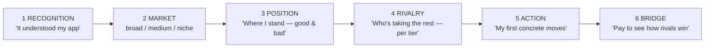

# The ideal free-scan flow — six stages, tiered market, backward-mapped to the implemented process

> **Status:** Flow definition + backward gap map, approved in principle by Tim (2026-07-19; flow "super awesome", tiered market added same day); WS-A (P0) flagged for immediate fix. This file supersedes the earlier flat workstream list — same items, organized under the flow they serve.
> **Owner's goal:** the free scan is an immediate free *scout* of the user's **app, industry, market, and competitors** — "this is a big industry, this is a big market I'm competing in, this is what my competitors are doing — and I want to pay to understand at a deeper level what they're doing to win." Every datum we pay for is shown; competitor *intel* stays paid-only.
> **Method constraint:** fix the class, keep the process simple. The 4-step pipeline (collect → findings → free-report → done) keeps its shape — this phase changes what we **validate, synthesize, render, and tease**, not the pipeline.

## 1. The ideal flow — six stages, one narrative

*"We looked you up. Here's your market at every altitude, your place in it, who's taking the rest, and your first moves. The full scan shows what they do to win."*

### Stage contracts (data pulled → assessed → synthesized → rendered → promoted)

**S1 Recognition — "it understood my app." (trust anchor; no tease)**
Data: site fetch (SPA-hardened — Part C dependency) + Tavily reviews **subject-validated** (WS-A). Assessed: positioning/audience extract + HTML signals. Synthesized: one-line identity + tiered market labels (M1). Rendered: identity strip under the gauge — *"SEO analytics for solo founders — a niche of SEO tooling, inside marketing software"* — and the Positioning Mirror only when grounded.

**S2 Market — the broad → medium → niche ladder (Tim, 2026-07-19).**
Every app sits in nested markets: ReachKit is a *marketing app* (broad, millions of searches/mo) → *SEO/rank-tracking tooling* (medium) → *discoverability for solo founders* (niche). The ideal render is a three-rung ladder, each rung: tier label · demand · **your standing on that rung** (best position or "not ranking"):

> Broad — marketing software — ~550k searches/mo — you: not ranking
> Medium — SEO analytics tools — ~12k/mo — you: not ranking
> Niche — rank tracking for solo founders — ~1.9k/mo — you: #9 for one term

Mechanics, honest by construction: the lite synth (M1) emits **labeled seed phrases per tier** (~3 broad / ~4 medium / ~4 niche — LLM names phrases, NEVER volumes); the same ONE `search_volume` request prices all of them (request-billed — phrase count is cost-free); per-tier demand = Σ that tier's rendered phrases (**G4 per tier**); the user's standing per rung comes from the ALREADY-fetched `ranked_keywords`/`categoryRanked` matched against each tier's phrases (M2) — no new call. The niche rung keeps today's scale-invariant merge (real rankings dominate; 0-ranking sites fall back to seeds). The existing single `categoryDemand` stays the niche/category rung; broad/medium are additive context, feed **nothing** into `sv.score` (invariant #1 untouched). Story the ladder tells: *big industry → your realistic beachhead → where you actually stand at each altitude.* Promotion: none yet.

**S3 Position — "where I stand, good and bad."**
Data: the ONE `ranked_keywords` + `domain_rank_overview` (unchanged). Rendered: driver bars, footprint split, **"you already win" strip** (`categoryRanked` top-3), gaps, **named** off-topic examples (WS-D). Soft tease: full signal breakdown.

**S4 Rivalry — "who's taking the rest — at each tier."**
Free, grounded, zero new cost: the **discovered** rival names (invariant #6: discovery-only) are the *niche* rung's rivals — *"Buyers compare you to X, Y, Z — and rivals are taking the searches above."* Honest no-rivals degrade (WS-E). Broad/medium tiers: naming their dominators requires SERP ground truth — LLM-naming rivals is forbidden (invariant #6) — so per rung it is either **D1(b)** (one SERP on the rung's top phrase names its real winners) or a **tease**: *"unlock: who dominates SEO tooling, and every search each one wins."* THE tease of the page lives here.

**S5 Action — "my first concrete moves."**
No new data. 3–5 fixes where **#1 names a real phrase + your position** from `categoryOpportunities` (WS-C, deterministic, impact-honest per 5a — derived delta or none, never invented); niche-rung opportunities naturally rank first (the beachhead). Teaser counts come from the SAME rows rendered (WS-B — kills "Unlock all 0"). Tease: "N more fixes + ready-to-ship drafts + weekly tracking."

**S6 Bridge — one promise, one vocabulary (R2).**
*Free tells you what's true; paid tells you what rivals do about it and what you do next, verified weekly.* Every UnlockLink phrases its lock as the paid continuation of ITS stage; the closing band unifies: *"The full scan shows what each rival does to win every search worth taking — with a weekly verified plan as you ship."*

## 2. Backward map — implemented process vs the six stages (the gap ledger)

Gap types: **BROKEN** (defect live) · **DATA** (not pulled) · **ASSESS** (not computed) · **SYNTH** (not synthesized) · **RENDER** (computed, never shown) · **PROMO** (tease weak/generic). Live evidence: prod scan `4093f1c9` (reachkit.app, 2026-07-19, score 9 = on-page 89 × search 0, 15¢).

| Stage | Implemented today (where) | Gaps | Fill |
|---|---|---|---|
| **S1 Recognition** | `collect` fetch → positioning extract (Haiku) → lite synth `listingSays`/audiences/mirror (`lib/llm/synth.ts` lite); HTML signals (`compute-signals`) | **BROKEN:** mirror rendered from **reachkit.ai's** reviews — no subject-validation in `web-reviews.ts` (acquire.io class, reviews edition). **RENDER:** identity line computed, never shown. **DATA-quality:** SPA fetch garbage (x.com class) — separate track | **WS-A** (fix first, alone) · **R1** · Part C (out of scope here) |
| **S2 Market** | lite synth → 4 flat seeds → ONE `search_volume` → `computeCategoryDemand` merge → single demand hero (3,480/mo — honest but *feels small*; G4 holds) | **SYNTH:** no tier structure, too few seeds. **ASSESS:** no per-tier rollup, no per-tier standing. **RENDER:** no ladder | **M1** tiered seeds (absorbs WS-F) · **M2** per-tier demand + standing (G4-per-tier, G7 one vocabulary) · **M3** ladder UI |
| **S3 Position** | classification via the ONE classifier → `sv.score`, capture, wins count, split bars, zero-state banner (all render) | **RENDER:** `categoryRanked` wins story + `offTopicExamples` computed, never shown | **WS-D** |
| **S4 Rivalry** | discovery (SERP alternatives + Tavily + PH + validated Haiku names) → comma list; vanishes when discovery is empty (reachkit.app: empty) | **BROKEN/RENDER:** no no-rivals state. **PROMO:** tease generic. **DATA:** tier winners need SERP ground truth (invariant #6 forbids LLM-named rivals) | **WS-E** both states · **R2** stage tease · **D1** decision below |
| **S5 Action** | `fallbackActionsFromSignals` (HTML signals only, max 5) + deterministic drafts; teaser count from `categoryGap` | **BROKEN:** "🔒 Unlock all **0** category opportunities" rendered live beside 4 opportunity rows. **ASSESS:** opportunities never become actions (page recommends *alt text* while its own diagnosis is search 0) | **WS-B** (count = same source as rows, conditional copy) · **WS-C** (opportunity actions, impact-honest) |
| **S6 Bridge** | 4 scattered generic UnlockLinks + 2 CTA bands (`results-screen.tsx`, `public-report.tsx`) | **PROMO:** no per-stage vocabulary; locks don't build on their stages | **R2** |

Cross-cutting, unchanged by all of the above: pipeline stays 4 steps; nothing feeds `sv.score` or the classifier (invariant #1 by construction, v5-parity eval must stay green); every new rendered field defaults `?? []` + joins the legacy-payload render test (reflect.app class); DS mirrors updated in the same change; free cost stays ≤ ~20¢ (today 15¢; only D1 adds ~1–3¢).

## 3. Open decision — D1: ground the tier winners with SERP calls on free?

Standing ruling (2026-07-17): **no rival fetch on free** — aimed at per-rival footprint fetches. The tiered rivalry stage makes the question concrete, per the Feedback Protocol (raised, not silently resolved):
- **(a) Zero new cost:** niche rivals = discovered names only (free today); broad/medium dominators stay a tease. Weaker wow — the "this is what my competitors are doing" half is promised, not shown.
- **(b) ≤3 SERP calls (~1¢ each), one per rung's top phrase:** free scan names the REAL winners per tier — *"Semrush & Ahrefs win 'rank tracking software' (1,600/mo)"* — fully rendered (passes "never pay for data you don't render"), grounded (satisfies invariant #6 — SERP is discovery, not LLM naming). Strongest wow; completes the formula. If chosen: hard cap, costed-step ledger entry, G-family guard (winner names must come from the SERP doc).
- Middle: (b) for the niche rung only (1 call, ~1¢).

**Recommendation: (b)** — it is the cheapest change that delivers "this is what my competitors are doing" on the free surface.

## 4. Sequencing & verification

1. **WS-A first, alone** (live honesty bug on the conversion surface). CLAUDE.md invariant #6/#11 wording + guard row in the same commit (Change Protocol).
2. **M1+M2+WS-B+WS-C** (synth + assembly, with guards) → **M3+WS-D+WS-E+R1+R2** (render/copy) — one or two PRs. D1 folds into WS-E when decided.
3. After each deploy, the free-report rule: rescan + headless-render **reachkit.app** (0-ranking + wrong-subject case), a normal SaaS, a directory — read the actual text. Acceptance for reachkit.app: no ungrounded mirror; identity strip renders; ladder shows 3 rungs with honest per-rung standing; no "all 0"; fix #1 names a real category phrase; no-rivals tease renders.
4. New guards, each mutation-proven: wrong-subject grounding scenario (WS-A) · per-tier G4 reconciliation + tier standing from real rows (M2) · teaser-count-equals-rendered-source (WS-B) · opportunity-action-names-real-phrase (WS-C) · conditional rivalry copy both states (WS-E) · D1 winner-names-from-SERP-doc if (b).

## 5. Explicitly out of scope
- Part C (SPA fetch/extract) — separate approved track; S1's quality dependency.
- Per-rival keyword/backlink fetches on free — locked paid-only (D1 covers only top-phrase SERPs).
- Paid-plan generator, score model, classifier — untouched.

## Appendix — live evidence detail (prod scan `4093f1c9`, 2026-07-19)

- **P0:** `raw_documents.web_reviews` holds Tavily results for **reachkit.ai** (Trustpilot; an email-outreach tool — hence the rendered "seamless Gmail integration") + a GetApp "Reachkit". The invariant-#11 answer-laundering fix held (`answer: null` today; the 2026-07-16 doc still ingested it). Missing: subject-validation of results.
- **P1:** rendered "🔒 Unlock all **0** category opportunities" beside 4 rendered rows (`fullGapQueries` in `app/(funnel)/scan/[id]/public-report.tsx` reads `categoryGap`, empty by construction for 0-ranking sites).
- **P2:** plan = "add alt text (+5)", "comparison pages (+4)" against a diagnosis of search presence 0 with 3,480/mo going elsewhere.
- Competitors: `facts.competitors` empty → entire rivalry stage absent from the page.
- Seeds: lite synth returned 4 flat phrases (`SEO analytics software`, `competitor analysis tools`, `rank tracking software`, `marketing analytics platform`) = 3,480/mo — the "feels small" evidence for the tier ladder.
